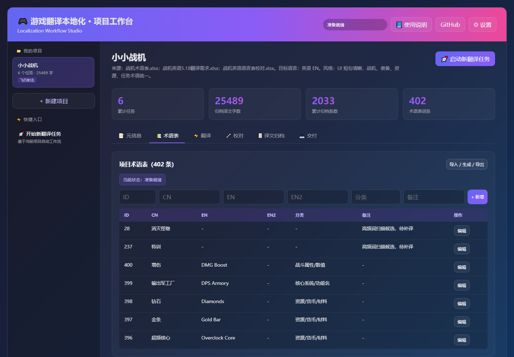

# Localization Workflow Studio

[](https://github.com/zhangzeyu99-web/localization-workflow-studio/actions/workflows/ci.yml)
[](LICENSE)
[](https://zhangzeyu99-web.github.io/localization-workflow-studio/)
[](https://github.com/zhangzeyu99-web/localization-workflow-studio/discussions/29)

[简体中文](README.zh-CN.md)

Local-first workflow studio for game localization teams that ship Excel language tables, AI-assisted translations, glossary checks, QA reports, and final delivery workbooks.

If your current localization flow is a folder full of workbooks, prompts, manual QA notes, and hard-to-reproduce model outputs, this project turns it into one auditable local workspace.



## Try It

- Live public demo: https://zhangzeyu99-web.github.io/localization-workflow-studio/
- AI game localization workflow guide: [docs/guides/ai-game-localization-workflow.html](docs/guides/ai-game-localization-workflow.html)
- Excel translation QA guide: [docs/guides/excel-translation-qa.html](docs/guides/excel-translation-qa.html)
- Getting started: [docs/GETTING_STARTED.md](docs/GETTING_STARTED.md)
- Public sample case: [docs/SHOWCASE.md](docs/SHOWCASE.md)
- Synthetic workbook: [examples/synthetic-language.xlsx](examples/synthetic-language.xlsx)
- Feedback thread: [GitHub Discussions #29](https://github.com/zhangzeyu99-web/localization-workflow-studio/discussions/29)
- Help wanted: [workbook formats and QA gates](https://github.com/zhangzeyu99-web/localization-workflow-studio/issues/30)

The hosted GitHub Pages demo is static and read-only. It does not upload files, call model providers, save data, or include real client material. Full workflow execution runs locally with the FastAPI backend.

## What Makes It Different

- Workbook-first: Excel language tables remain the delivery surface instead of being replaced by a SaaS database.
- Local-first: private strings, provider keys, SQLite files, and generated artifacts stay outside the public repo.
- Audit-first: prompts, glossary snapshots, workpack fingerprints, QA findings, and final workbooks are traceable.
- Provider-safe: mock or missing-provider output is blocked before it can become real delivery.
- LQA-oriented: placeholder, tag, line-break, terminology, readability, and UI-length checks are treated as delivery gates.

## Who It Is For

- Game localization producers who need traceable Excel delivery gates.
- Translators and LQA reviewers who need glossary and placeholder consistency checks.
- Small teams using GPT or Claude for assisted translation but still requiring human-reviewable artifacts.
- Developers building local-first localization tooling around workbooks, QA rules, and provider adapters.

## What It Does

- Builds project profiles from game context, reference material, and glossary data.
- Generates translation prompts with project rules, terminology, placeholders, tags, and UI length hints.
- Converts Excel language tables into batchable workpacks for AI-assisted translation.
- Blocks mock or missing-provider output from being treated as real delivery.
- Runs rule-based QA for placeholders, tags, line breaks, terminology, readability, and UI length.
- Supports manual fix loops before final delivery.
- Archives reviewed translations and produces final workbooks plus change artifacts.
- Keeps runtime data outside the public repository by default.

## Why Star This Repo

Star it if you want a practical reference for:

- local-first AI workflow design,
- game-localization QA automation,
- Excel-based delivery pipelines,
- safe provider configuration,
- reproducible translation review gates,
- React + FastAPI workflow tooling.

## Quick Start

Requirements:

- Python 3.11+
- Node.js 20+
- PowerShell on Windows, or equivalent shell commands on macOS/Linux

```powershell
git clone https://github.com/zhangzeyu99-web/localization-workflow-studio.git
cd localization-workflow-studio

python -m pip install -r backend\requirements.txt

cd frontend
npm ci
npm run build
```

Run the backend:

```powershell
cd localization-workflow-studio
python -m uvicorn app.main:app --app-dir backend --host 127.0.0.1 --port 8000
```

Run the frontend:

```powershell
cd localization-workflow-studio\frontend
npm run dev
```

Open:

```text
http://127.0.0.1:5173
```

More setup detail is in [docs/GETTING_STARTED.md](docs/GETTING_STARTED.md).

## Architecture

```text
localization-workflow-studio/
  backend/                FastAPI API, SQLite access, provider adapters, workflow adapters
  frontend/               React/Vite local workbench
  workflow/
    localization/         Translation workpack and QA core
    glossary/             Glossary extraction and review core
  examples/               Public synthetic workbook for demos and smoke tests
  docs/                   Public docs and GitHub Pages static workbench
  settings.example.json   Public configuration example
```

Runtime data should stay outside the repository:

```text
D:\codex\localization-workflow-studio-data
```

That directory stores private settings, SQLite files, uploaded workbooks, reference material, run logs, workpacks, QA reports, and final deliverables.

## Provider Safety

The public repo only includes `settings.example.json`.

Real provider configuration belongs outside the repo:

```text
D:\codex\localization-workflow-studio-data\settings.local.json
```

Provider keys must not be committed to the frontend, GitHub Pages, screenshots, README examples, public issues, or test fixtures.

## Quality Gates

A real delivery must satisfy these gates:

1. The run has a prompt snapshot, project harness snapshot, and glossary snapshot.
2. The workpack records IDs, source text, text type, placeholders, tags, line-break shape, glossary hits, UI length hints, and input fingerprints.
3. Model output follows the JSONL line protocol: each line contains only `id` and `translation`.
4. Apply validates ID, order, placeholders, tags, line breaks, and input fingerprints before writing back.
5. Final workbook passes rule QA and project-rule QA with zero hard issues.
6. Reviewed translations are archived only after QA passes.

Importing an already translated workbook for QA is supported. It proves the Studio reviewed the workbook; it does not claim the Studio performed the original translation.

## Validation

Backend and integration tests:

```powershell
python -m pytest -q
```

Workflow baseline tests:

```powershell
Push-Location workflow\localization
python -m pytest -q
Pop-Location

Push-Location workflow\glossary
python -m pytest -q
Pop-Location
```

Frontend build:

```powershell
cd frontend
npm run build
```

Browser E2E, after starting backend and frontend:

```powershell
cd frontend
$env:E2E_BASE_URL = "http://127.0.0.1:5173"
npm run e2e
```

## Documentation

- [Getting started](docs/GETTING_STARTED.md)
- [Showcase](docs/SHOWCASE.md)
- [AI game localization workflow guide](docs/guides/ai-game-localization-workflow.html)
- [Excel translation QA guide](docs/guides/excel-translation-qa.html)
- [Configuration](docs/CONFIGURATION.md)
- [File and data management](docs/FILE_MANAGEMENT.md)
- [Storage model](docs/STORAGE.md)
- [Use cases](docs/USE_CASES.md)
- [Quality gates](docs/QUALITY_GATES.md)
- [Iteration process](docs/ITERATION.md)
- [Roadmap](docs/ROADMAP.md)
- [Launch kit](docs/LAUNCH.md)
- [GitHub management](docs/GITHUB_MANAGEMENT.md)
- [Changelog](CHANGELOG.md)
- [Contributing](CONTRIBUTING.md)
- [Security](SECURITY.md)

## Version

Current version: `0.5.0`

Version references are maintained in:

- `VERSION`
- `backend/app/main.py`
- `frontend/package.json`

Before publishing a release or tag, follow the release checklist in [docs/GITHUB_MANAGEMENT.md](docs/GITHUB_MANAGEMENT.md).

## License

MIT. See [LICENSE](LICENSE).
