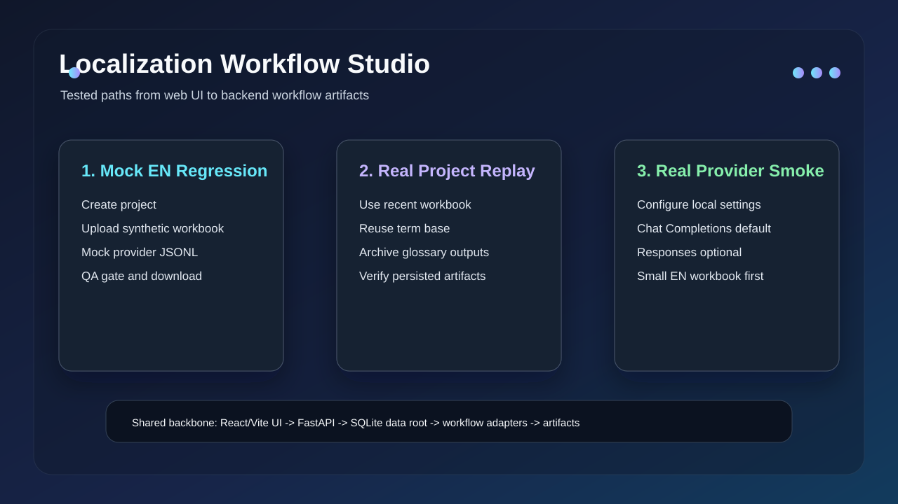
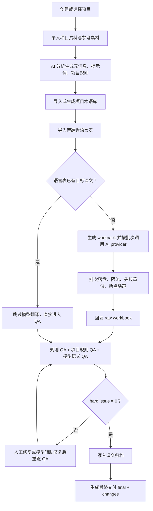
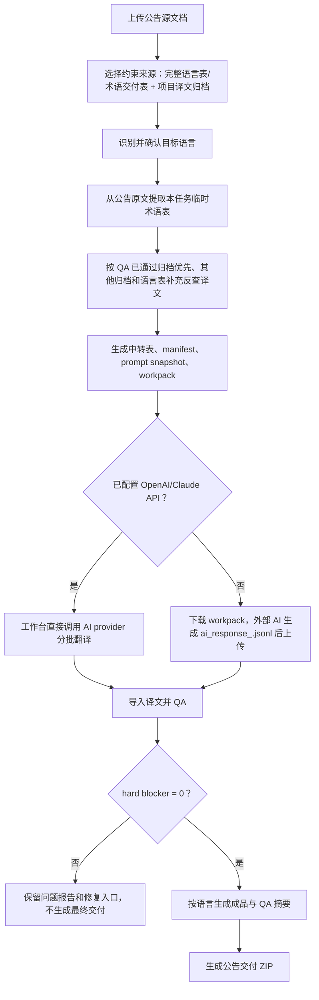

# Localization Workflow Studio

[](https://github.com/zhangzeyu99-web/localization-workflow-studio/actions/workflows/ci.yml)

Localization Workflow Studio 是一个面向游戏本地化项目的本地 Web 工作台。它把项目资料、项目元信息、翻译提示词、术语库、模型翻译、规则 QA、译文归档、公告外文本工作流和最终交付集中到同一个项目视图里。


## 风险收束与运行边界

- 工作台是本地桌面 Web 应用：后端默认只应绑定本机地址，公网或局域网共享前需要额外认证和网络隔离。
- 长文本翻译由后端编排器负责拆批、限流、断点续跑、取消和失败恢复；Codex/Agent 不是运行依赖。
- 正式模型路径只支持 OpenAI/GPT、GPT 中转站与 Claude；测试环境使用隐藏 test-fake，不作为产品 provider。
- API key 写入私有 `settings.local.json`，不要提交到仓库；线上 Web 版不显示前端设置入口。
- 项目明确禁止 Google Translate、`deep_translator`、`googletrans`、浏览器机翻和在线机翻聚合器。
- 上传文件默认上限 200 MiB，可用 `LWS_MAX_UPLOAD_MB` 调整；超限会返回 413。


## 入口

| 入口 | 地址 | 说明 |
|---|---|---|
| GitHub 仓库 | https://github.com/zhangzeyu99-web/localization-workflow-studio | 源码、文档、CI 和版本管理 |
| GitHub Pages Demo | https://zhangzeyu99-web.github.io/localization-workflow-studio/ | 只读静态示例，不上传文件、不调用模型、不保存数据 |
| 飞书使用说明书 | https://my.feishu.cn/docx/Pt9pdBypNoLy5MxYpZ3cr3A8nMc | 面向准备使用项目的同事，包含图文流程和优化建议 |



## 当前能力边界

- 前端：React + Vite。
- 后端：FastAPI + SQLite。
- 正式语言：语言包工作流和公告外文本工作流共用同一组语言配置：EN / KR / JP / FR / DE / RU / IT / ES / PT / TR / IDN / TH / AR。
- Provider：正式入口支持 OpenAI/GPT、GPT 中转站与 Claude；测试环境使用隐藏 test-fake，不作为产品 provider。
- 长文本翻译：由后端任务编排器拆批、限流、断点续跑和失败恢复；不依赖 Codex/Agent 才能运行。
- Agent 本地大语言包任务：使用 `workflow/localization/scripts/run_large_text_multilingual_*.py` 做 preflight、API manifest、cache-lint、readback 和 retro；cache-lint 已覆盖机器型括号 token、富文本/换行占位、中文小数字和日期过滤、千/万/M/K 等跨语言数字单位、强术语命中，以及 skipped/waived gate 状态和超过一小时任务的 retro 复盘提示。详细流程见 `docs/LARGE_TEXT_MULTILINGUAL_WORKFLOW.md`。
- 公告翻译：项目内 9 步外文本工作流，支持公告资料、约束来源、目标语言、术语提取、译文反查、翻译准备、AI 翻译/导入、校对回填和交付。
- 禁止路径：不使用 Google Translate、`deep_translator`、`googletrans` 或浏览器机翻。
- GitHub Pages：只是公开静态 Demo。完整功能必须启动 FastAPI 后端并使用私有数据目录。

## 能否只用主仓库安装

可以。主仓库已经内置两个底层 workflow 副本：

```text
workflow/localization   本地化翻译、QA、回填、交付核心
workflow/glossary       术语提取、公告术语反查、AI 漏词补充核心
```

运行工作台不需要再单独 clone：

```text
D:\codex\glossary-extraction-workflow
D:\project\localization-workflow-project
```

这两个仓库只作为底层技术源仓库/上游开发仓库使用。工作台运行时以主仓库内置副本为准。

当前安装形态仍是源码级安装或发布包部署：开发环境需要启动 Python 后端和 Node/Vite 前端两个进程；线上环境使用构建后的 `frontend/dist` 加后端单实例服务。

## 项目主流程



## 公告外文本流程

公告翻译是项目内功能，用于游戏外公告、活动说明、长文本或 DOCX/TXT/XLSX 外文本。



公告最终交付 ZIP 只包含成品和 QA 摘要，不把 workpack、manifest、prompt 等过程文件塞进最终交付包。

## 仓库结构

```text
localization-workflow-studio/
  .github/                GitHub Actions、Issue 模板、PR 模板、依赖更新配置
  backend/                FastAPI 后端、SQLite 访问、provider adapter、workflow adapter
  frontend/               React/Vite 本地工作台
  workflow/
    localization/         本地化翻译与质量校验核心
    glossary/             术语提取与术语 harness 核心
  examples/               可公开的合成样例
  docs/                   项目文档与 GitHub Pages 静态 Demo
  settings.example.json   可公开的配置样例
```

不要把真实项目数据放进仓库。运行数据默认放在：

```text
D:\codex\localization-workflow-studio-data
```

该目录保存：

```text
settings.local.json
studio.sqlite3
projects/
runs/
artifacts/
uploads/
```

如果换电脑、没有 D 盘，或希望使用其他位置，启动前设置：

```powershell
$env:LWS_DATA_ROOT = "C:\localization-workflow-studio-data"
```

## 安装

推荐环境与 CI 一致：

```text
Python 3.12
Node.js 22
```

克隆主仓库：

```powershell
git clone https://github.com/zhangzeyu99-web/localization-workflow-studio.git
cd localization-workflow-studio
```

建议使用独立 Python 虚拟环境：

```powershell
python -m venv .venv
.\.venv\Scripts\Activate.ps1
python -m pip install --upgrade pip
```

安装 Python 依赖：

```powershell
python -m pip install -r backend\requirements.txt
```

安装并构建前端：

```powershell
cd frontend
npm ci
npm run build
cd ..
```

最短本地启动方式：

```powershell
# 终端 1：后端
cd D:\codex\localization-workflow-studio
.\.venv\Scripts\Activate.ps1
python -m uvicorn app.main:app --app-dir backend --host 127.0.0.1 --port 8000
```

```powershell
# 终端 2：前端
cd D:\codex\localization-workflow-studio\frontend
npm run dev
```

然后打开 `http://127.0.0.1:5173`。

## 本地启动

启动后端：

```powershell
cd D:\codex\localization-workflow-studio
python -m uvicorn app.main:app --app-dir backend --host 127.0.0.1 --port 8000
```

启动前端：

```powershell
cd D:\codex\localization-workflow-studio\frontend
npm run dev
```

打开：

```text
http://127.0.0.1:5173
```

前端默认把 `/api` 代理到：

```text
http://127.0.0.1:8000
```

如果后端端口不同，启动前端前设置：

```powershell
$env:LWS_API_TARGET = "http://127.0.0.1:8000"
```

## 迁移已有项目数据

迁移工作台时，复制数据目录即可：

```text
旧机器 D:\codex\localization-workflow-studio-data
→ 新机器的 LWS_DATA_ROOT
```

至少需要保留：

```text
studio.sqlite3
settings.local.json
projects/
runs/
artifacts/
uploads/
```

如果不想迁移 API key，可以不复制 `settings.local.json`；本地调试可在设置里重新配置，线上部署必须由运维写入配置文件。

## Provider 配置

公开仓库只保留 `settings.example.json`。真实配置写入仓库外：

```text
<LWS_DATA_ROOT>\settings.local.json
```

本地网页“设置”支持配置；线上 Web 版不显示设置按钮，直接编辑配置文件：

- Provider：OpenAI/GPT、GPT 中转站或 Claude。
- 预设：快速、平衡、深度、关键校对。
- API key。
- 长文本拆批、限流、重试和预算提醒由系统按预设自动管理，不需要人工调参。

API key 必须留在后端或本地私有配置中，不要写进前端、GitHub Pages、截图、README 或公开 issue。

## 无 Agent 运行模式

工作台的正式运行不依赖 Codex/Agent。Codex 只用于开发、排障或人工辅助，不参与生产链路的必要步骤。

配置 OpenAI/GPT 或 Claude API key 后，工作台后端可以直接完成：

- 项目资料语义分析和项目提示词生成。
- 术语 AI 漏词补充。
- 语言包和公告外文本的分批 AI 翻译。
- 模型语义 QA 和可修复批次的 repair。

以下步骤始终由本地 workflow/harness 执行，不调用模型：

- workbook / DOCX / TXT / XLSX 解析。
- workpack、manifest、prompt snapshot 和中转表生成。
- ID、顺序、变量、标签、换行、HTML entity、内部 token、输入指纹等硬规则校验。
- 回填、apply、deliver、交付命名和 ZIP/Excel 打包。

没有 API key 时，工作台仍可运行本地流程：项目管理、术语导入/导出、已有译文 QA、公告术语提取、workpack 下载、外部 `ai_response_<LANG>.jsonl` 上传、回填和交付。它不会降级调用 Google、浏览器机翻或在线机翻聚合器。

## 质量门槛

标准交付必须同时满足：

1. 本次 run 有 prompt snapshot、project harness snapshot、glossary snapshot。
2. 翻译 workpack 记录 ID、源文、文本类型、占位符、标签、换行形态、术语命中、UI 长度和输入指纹。
3. 模型返回必须遵守 JSONL 行协议：每行只允许 `id` 和 `translation`。
4. 回填前校验 ID、顺序、占位符、标签、换行和输入指纹。
5. 最终 workbook 通过规则 QA 和项目规则 QA，hard issue 必须为 0。
6. QA 通过后生成标准交付，并以 `source_type=qa_passed` 写入可信译文归档。

QA 未通过但已生成可用译文时，工作台允许生成“带问题交付”：交付文件必须附带 QA 问题摘要，对应译文继续写入归档，但标记为 `source_type=delivered_with_issues`（界面显示“待复核”）。这是一条有明确风险标记的应急路径，不等同于标准交付。

直接上传已有译文 workbook 做 QA 是支持的，但它证明的是“Studio 做过校对”，不是“Studio 做过初译”。

## 交付规范

语言包最终交付保持双 Excel：

```text
{项目名}_{LANG}_{YYYYMMDDHHmm}_{任务码}-{run短ID}_final.xlsx
{项目名}_{LANG}_{YYYYMMDDHHmm}_{任务码}-{run短ID}_changes.xlsx
```

用户可见语言代码：

```text
EN / KR / JP / FR / DE / RU / IT / ES / PT / TR / IDN / TH / AR
```

公告最终交付为 ZIP：

```text
{项目名}_{源文件名}_announcement_delivery_{YYYYMMDD}.zip
```

ZIP 只包含：

```text
{LANG}/{源文件名}_{LANG}.{ext}
QA摘要.xlsx
```

过程产物、workpack、manifest、prompt、AI response 不进入最终 ZIP，只在工作台产物区下载。

## Linux / 线上部署快速验收

源码部署时需要自行构建前端：

```bash
cd /data/web/lwstudio
python3.11 -m pip install -r backend/requirements.txt
python3.11 -m pip install -r workflow/glossary/requirements.txt
python3.11 -m pip install -r workflow/localization/requirements.txt
cd frontend && npm install && npm run build && cd ..
```

后端推荐用发布包内置脚本启动：

```bash
APP_HOME=/data/web/lwstudio \
LWS_DATA_ROOT=/data/web/lwstudio/lws-data \
LWS_DEPLOYMENT_MODE=cloud \
LWS_MAX_UPLOAD_MB=1024 \
./start-lws.sh
```

上线后先跑部署自检，再跑业务冒烟：

```bash
python3.11 check.py --base-url https://ai-lwstudio.example.com --require-cloud --require-provider --expect-version $(cat VERSION)
python3.11 scripts/stability_check.py --base-url https://ai-lwstudio.example.com
```

详细说明见 `docs/CLOUD_DEPLOYMENT.md`。

## 测试

后端与集成测试：

```powershell
cd D:\codex\localization-workflow-studio
python -m pytest -q
```

工作流基线测试：

```powershell
Push-Location workflow\localization
python -m pytest -q
Pop-Location

Push-Location workflow\glossary
python -m pytest -q
Pop-Location
```

前端构建：

```powershell
cd frontend
npm run build
```

浏览器 E2E：

```powershell
cd frontend
npx playwright install chromium
npm run e2e
```

`frontend/playwright.config.ts` 会为 E2E 自动启动测试后端和前端，并使用临时数据目录。

CI 会在 GitHub Actions 上跑 Python tests、workflow tests、frontend build 和浏览器 E2E。

## GitHub Pages

GitHub Pages 使用 `docs/index.html` 作为公开静态 Demo。

Pages Demo 不能包含真实 workbook、客户素材、API key、SQLite、run 日志或生成交付文件。

## 文档

- [飞书图文使用说明书](https://my.feishu.cn/docx/Pt9pdBypNoLy5MxYpZ3cr3A8nMc)
- [配置说明](docs/CONFIGURATION.md)
- [文件与数据管理](docs/FILE_MANAGEMENT.md)
- [存储模型](docs/STORAGE.md)
- [用例说明](docs/USE_CASES.md)
- [质量门槛](docs/QUALITY_GATES.md)
- [迭代方式](docs/ITERATION.md)
- [GitHub 管理](docs/GITHUB_MANAGEMENT.md)
- [更新日志](CHANGELOG.md)
- [v1.0.0 正式版说明](docs/releases/v1.0.0.md)
- [v1.1.0 正式版说明](docs/releases/v1.1.0.md)
- [许可证](LICENSE)

## 版本


当前版本：`1.3.0`

- `VERSION`
- `backend/app/main.py`
- `frontend/package.json`
- `frontend/package-lock.json`

发布和打 tag 前按 [GitHub 管理](docs/GITHUB_MANAGEMENT.md) 的 release checklist 执行。
