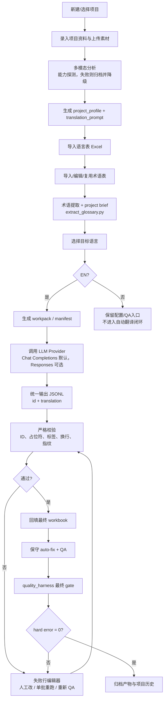

# Localization Workflow Studio

[](https://github.com/zhangzeyu99-web/localization-workflow-studio/actions/workflows/ci.yml)

Local web studio for game localization workflows. It combines project onboarding, project prompt generation, glossary extraction, EN translation workpack generation, model-provider translation, strict QA, and artifact history.


## What It Integrates

This repository is the product shell around two workflow codebases:

- [`zhangzeyu99-web/localization-workflow`](https://github.com/zhangzeyu99-web/localization-workflow)
- [`zhangzeyu99-web/glossary-extraction-workflow`](https://github.com/zhangzeyu99-web/glossary-extraction-workflow)

The copied workflow code lives under:

```text
workflow/localization
workflow/glossary
```

The web app and backend adapter live outside those workflow folders so upstream workflow changes can be re-applied with a narrow adapter check.

## Workflow



## Current Scope

- Frontend: React + Vite.
- Backend: FastAPI + SQLite.
- Provider presets: GPT and Claude only, each with `fast`, `balanced`, and `deep` presets.
- Test provider: internal `mock`, used by CI and local E2E when no API key is available.
- Real project translation is blocked when the active provider is `mock` or a required API key is missing. Mock output must not be treated as a deliverable translation.
- True v1 closed loop: EN translation.
- Project brief and translation prompt generation can use auxiliary project materials via the embedded glossary workflow `--project-material` / `--project-note` adapter; Studio passes uploaded project assets into glossary extraction.
- Other languages: visible configuration entry only; they do not pretend to be completed by automation.

## Quality Gates

Formal translation delivery is accepted only when all quality evidence exists for the same run:

1. Prompt snapshot: project prompt plus project harness are compiled into the run style hint.
2. Pre-translation pack: the workpack records row ID, source text, text type, placeholders, tags, newline shape, terminology hits, UI length metadata, and input fingerprint.
3. Pre-backfill validation: response JSONL must match IDs and order, preserve placeholders, tags, newline shape, and pass input drift checks before the workbook is written.
4. Pre-delivery gate: machine QA and project harness QA must pass with zero hard errors.

Direct QA of an uploaded translated workbook is supported, but it is a QA run, not proof that Studio performed the translation. See [Quality gates](docs/QUALITY_GATES.md).

## Data Policy

Runtime data is outside the public repository:

```text
D:\codex\localization-workflow-studio-data
```

This directory stores uploaded workbooks, generated workbooks, logs, SQLite, project files, artifacts, and `settings.local.json`.

## Quick Start

```powershell
cd D:\codex\localization-workflow-studio
python -m pip install -r backend\requirements.txt

cd frontend
npm ci
npm run build
cd ..

python -m uvicorn app.main:app --app-dir backend --host 127.0.0.1 --port 8000
```

In another terminal:

```powershell
cd D:\codex\localization-workflow-studio\frontend
npm run dev
```

Open:

```text
http://127.0.0.1:5173
```

## Provider Settings

Public repository files only include `settings.example.json`. Runtime secrets are stored in:

```text
D:\codex\localization-workflow-studio-data\settings.local.json
```

For a real provider, open the web settings modal and configure:

- provider: `GPT` or `Claude`
- preset: `快速响应`, `平衡`, or `深度思考`
- API key
- batch size

Preset model map:

| Provider | 快速响应 | 平衡 | 深度思考 |
|---|---|---|---|
| GPT | `gpt-5.4-mini` | `gpt-5.5` | `gpt-5.5-pro` |
| Claude | `claude-haiku-4-5-20251001` | `claude-sonnet-4-6` | `claude-opus-4-7` |

See [Configuration](docs/CONFIGURATION.md) for data-root overrides, API key handling, batch sizing, mock boundaries, and API examples.

## Test Matrix

Run backend and workflow tests:

```powershell
python -m pytest -q

Push-Location workflow\localization
python -m pytest -q
Pop-Location

Push-Location workflow\glossary
python -m pytest -q
Pop-Location
```

Run frontend build:

```powershell
cd frontend
npm run build
```

Run browser E2E after local backend and frontend are running:

```powershell
cd frontend
$env:E2E_BASE_URL = "http://127.0.0.1:5173"
npm run e2e
```

Replay a recent real project with mock provider:

```powershell
cd frontend
$root = "C:\Users\Administrator\Desktop\本地化处理\明日2_5.15"
$env:E2E_BASE_URL = "http://127.0.0.1:5173"
$env:E2E_SOURCE_WORKBOOK = Join-Path $root "2.0欧美翻译需求0515NT全语.xlsx"
$env:E2E_TERM_WORKBOOK = Join-Path $root "明日2术语表.xlsx"
npm run e2e
```

## Documentation

- [Use cases](docs/USE_CASES.md)
- [Configuration](docs/CONFIGURATION.md)
- [Iteration model](docs/ITERATION.md)
- [GitHub management](docs/GITHUB_MANAGEMENT.md)
- [Quality gates](docs/QUALITY_GATES.md)
- [Changelog](CHANGELOG.md)
- [License](LICENSE)

## Version

Current version: `0.4.4`

Version markers:

- `VERSION`
- `backend/app/main.py`
- `frontend/package.json`

See [GitHub management](docs/GITHUB_MANAGEMENT.md) for release and tag rules.
