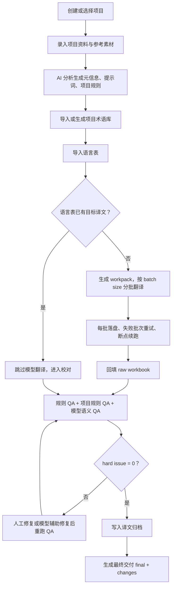

# Localization Workflow Studio

[](https://github.com/zhangzeyu99-web/localization-workflow-studio/actions/workflows/ci.yml)

Localization Workflow Studio 是一个面向游戏本地化项目的本地 Web 工作台。它把项目资料、项目元信息、翻译提示词、术语库、模型翻译、规则 QA、译文归档和最终交付集中到同一个项目视图里。

## 入口

| 入口 | 地址 | 说明 |
|---|---|---|
| GitHub 仓库 | https://github.com/zhangzeyu99-web/localization-workflow-studio | 源码、文档、CI 和版本管理 |
| GitHub Pages Demo | https://zhangzeyu99-web.github.io/localization-workflow-studio/ | 只读静态示例，不上传文件、不调用模型、不保存数据 |
| 飞书使用说明书 | https://my.feishu.cn/docx/Pt9pdBypNoLy5MxYpZ3cr3A8nMc | 面向准备使用项目的同事，包含图文流程和优化建议 |


## 当前能力边界

- 前端：React + Vite。
- 后端：FastAPI + SQLite。
- 自动闭环：v1 以英语 EN 为主。
- Provider：正式入口保留 GPT 和 Claude；mock 仅用于 CI、本地 E2E 和无 key 链路验证。
- 真实项目翻译：当 provider 是 mock 或 API key 缺失时必须阻断，不能把 mock 结果当正式交付。
- 其他语言：保留配置和 QA 入口，不伪装自动翻译完成。
- GitHub Pages：仅是公开演示入口，完整功能需要 FastAPI 后端和私有数据目录。

## 项目主流程



## 仓库结构

```text
localization-workflow-studio/
  .github/                GitHub Actions、Issue 模板、PR 模板、依赖更新配置
  backend/                FastAPI 后端、SQLite 访问、provider adapter、workflow adapter
  frontend/               React/Vite 本地工作台
  workflow/
    localization/         本地化翻译与质量校验核心
    glossary/             术语提取与术语 harness 核心
  examples/               可公开的合成样例
  docs/                   项目文档与 GitHub Pages 静态 Demo
  tests/                  跨模块 mock E2E / 回归测试
  settings.example.json   可公开的配置样例
```

不要把真实项目数据放进仓库。运行数据默认放在：

```text
D:\codex\localization-workflow-studio-data
```

该目录保存 `settings.local.json`、SQLite、上传 workbook、参考素材、run 日志、workpack、QA 报告、最终 workbook 和交付文件。

## 本地启动

安装 Python 依赖：

```powershell
cd D:\codex\localization-workflow-studio
python -m pip install -r backend\requirements.txt
```

安装并构建前端：

```powershell
cd D:\codex\localization-workflow-studio\frontend
npm ci
npm run build
```

启动后端：

```powershell
cd D:\codex\localization-workflow-studio
python -m uvicorn app.main:app --app-dir backend --host 127.0.0.1 --port 8000
```

启动前端：

```powershell
cd D:\codex\localization-workflow-studio\frontend
npm run dev
```

打开：

```text
http://127.0.0.1:5173
```

## Provider 配置

公开仓只保留 `settings.example.json`。真实配置写入仓库外：

```text
D:\codex\localization-workflow-studio-data\settings.local.json
```

网页右上角“设置”支持配置：

- Provider：GPT 或 Claude。
- 预设：快速、平衡、深度思考。
- API key。
- batch size。

Provider key 必须留在后端或本地私有配置中，不要写入前端、GitHub Pages、截图、README 或公开 issue。

## 质量门槛

正式交付必须同时满足：

1. 本次 run 有 prompt snapshot、project harness snapshot、glossary snapshot。
2. 翻译 workpack 记录 ID、源文、文本类型、占位符、标签、换行形态、术语命中、UI 长度和输入指纹。
3. 模型返回必须遵守 JSONL 行协议：每行只允许 `id` 和 `translation`。
4. 回填前校验 ID、顺序、占位符、标签、换行和输入指纹。
5. 最终 workbook 通过规则 QA 和项目规则 QA，hard issue 必须为 0。
6. QA 通过后才写入译文归档并进入最终交付页。

直接上传已有译文 workbook 做 QA 是支持的，但它证明的是“Studio 做过校对”，不是“Studio 做过翻译”。

## 测试

后端和集成测试：

```powershell
cd D:\codex\localization-workflow-studio
python -m pytest -q
```

工作流基线测试：

```powershell
Push-Location workflow\localization
python -m pytest -q
Pop-Location

Push-Location workflow\glossary
python -m pytest -q
Pop-Location
```

前端构建：

```powershell
cd frontend
npm run build
```

浏览器 E2E 需要先启动后端和前端：

```powershell
cd frontend
$env:E2E_BASE_URL = "http://127.0.0.1:5173"
npm run e2e
```

CI 会在 GitHub Actions 上跑 Python tests、workflow tests、frontend build 和浏览器 E2E。

## GitHub Pages

GitHub Pages 使用 `docs/index.html`，作为公开静态 Demo：

1. Repository Settings。
2. Pages。
3. Build and deployment 选择 `Deploy from a branch`。
4. Branch 选择 `master`，目录选择 `/docs`。
5. 保存后，下一次 push 会发布 Demo。

Pages Demo 不能包含真实 workbook、客户素材、API key、SQLite、run 日志或生成交付文件。

## 文档

- [飞书图文使用说明书](https://my.feishu.cn/docx/Pt9pdBypNoLy5MxYpZ3cr3A8nMc)
- [配置说明](docs/CONFIGURATION.md)
- [文件与数据管理](docs/FILE_MANAGEMENT.md)
- [存储模型](docs/STORAGE.md)
- [用例说明](docs/USE_CASES.md)
- [质量门槛](docs/QUALITY_GATES.md)
- [迭代方式](docs/ITERATION.md)
- [GitHub 管理](docs/GITHUB_MANAGEMENT.md)
- [更新日志](CHANGELOG.md)
- [许可证](LICENSE)

## 版本

当前版本：`0.4.9`

版本号需要同步维护：

- `VERSION`
- `backend/app/main.py`
- `frontend/package.json`

发布和打 tag 前按 [GitHub 管理](docs/GITHUB_MANAGEMENT.md) 的 release checklist 执行。
