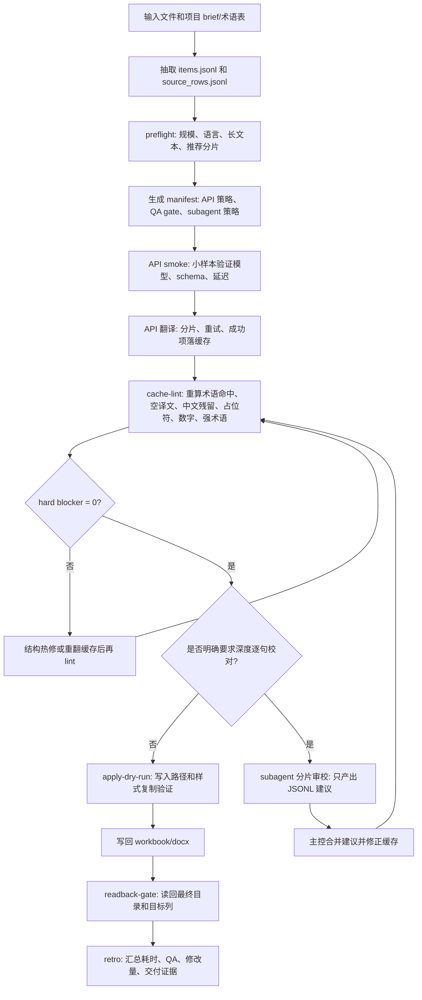

# 大文本多语言本地工作流

## 定位

这个流程用于 Codex/Agent 处理本地大 workbook、DOCX 公告或多语言包任务时的执行编排。它不替代产品后端工作流；产品内真实运行仍由 `backend/app/workflow/multilingual.py`、`backend/app/workflow/translation_orchestrator.py` 和 QA 模块负责拆批、限流、断点续跑、取消、失败恢复和交付。

本地 harness 的目标是减少人工任务中的慢点和错漏：先识别规模和语言范围，再使用 API 做语义翻译，用确定性 gate 在写入前拦截硬错误，必要时用 subagent 做深度逐句校对，最后读回交付和生成复盘证据。

术语校对细则见 `docs/TERMINOLOGY_TRANSLATION_PROOFREADING_STANDARD.md`，深度逐句校对和 subagent 细则见 `docs/DEEP_LINE_PROOFREADING_SUBAGENT_WORKFLOW.md`。

## 真实项目执行流程



## API 使用方式

- API 只承担语义翻译和可选的语义修正，不承担最终写文件。
- `--relay-config` 指向本机私有配置，例如 `D:\codex\localization-workflow-studio-data\settings.local.json`。
- manifest 只记录 `host/path/model/provider/protocol`，不会写入 `api_key`。
- API smoke 必须先跑小样本，确认 endpoint、schema 和返回模型可用后再进入批量翻译。
- 批量翻译应按 manifest 的 `bucket_policy` 和 `retry_policy` 执行：短 UI 可大批，长文本小批；500、timeout、JSON 错误先拆批重试，已成功 key 写入缓存。

## Subagent 使用方式

- 默认不启用 subagent；只有用户明确要求“深度校对/逐句校对/全量审校”时启用。
- subagent 不继承大段历史上下文，只接收项目 brief、术语约束、目标语言、待审分片和输出格式，避免上下文窗口膨胀。
- subagent 禁止直接改 workbook/docx；输出必须是 JSONL 建议，字段至少包含 `key`、`lang`、`current`、`suggested`、`reason`、`severity`。
- 主控负责去重、判断是否接受、写回缓存，再跑 `cache-lint` 和最终 readback。

## CLI 入口

```powershell
cd D:\codex\localization-workflow-studio\workflow\localization

python scripts\run_large_text_multilingual_runner.py prepare `
  --work-dir "<task>\\_work\\large_text_multilingual" `
  --items-jsonl "<task>\\_work\\items.jsonl" `
  --source-rows-jsonl "<task>\\_work\\source_rows.jsonl" `
  --target-langs "DE,FR,ES,PT,RU,IT,TR,TH" `
  --workbook-count 2 `
  --relay-config "D:\codex\localization-workflow-studio-data\settings.local.json" `
  --proofread-mode basic

python scripts\run_large_text_multilingual_gate.py cache-lint `
  --cache-jsonl "<task>\\_work\\translation_cache.jsonl" `
  --term-base "<task>\\_source\\术语快照_revNNN.xlsx" `
  --target-langs "DE,FR,ES,PT,RU,IT,TR,TH" `
  --out "<task>\\_work\\large_text_multilingual\\cache_lint.json"

python scripts\run_large_text_multilingual_gate.py readback-gate `
  --delivery-dir "<task>\\交付目录" `
  --target-langs "DE,FR,ES,PT,RU,IT,TR,TH" `
  --out "<task>\\_work\\large_text_multilingual\\readback_gate.json"

python scripts\run_large_text_multilingual_retro.py `
  --task-name "<项目名>" `
  --work-dir "<task>\\_work\\large_text_multilingual" `
  --delivery-dir "<task>\\交付目录" `
  --preflight-metrics "<task>\\_work\\large_text_multilingual\\preflight.json" `
  --cache-lint "<task>\\_work\\large_text_multilingual\\cache_lint.json" `
  --readback-gate "<task>\\_work\\large_text_multilingual\\readback_gate.json" `
  --out-dir "<task>\\_work\\large_text_multilingual\\retro"
```

## 边界和缺口

- 这个 harness 不直接从任意 Excel 推断业务列并生成译文；真实任务仍应先由项目脚本或现有 workbook harness 抽取 `items.jsonl/source_rows.jsonl`，再进入本流程。
- 本地 gate 是确定性门禁，不替代语义校对；漏译、错译、语境不自然必须通过模型翻译和逐句审校处理。
- 在线术语表任务必须冻结当前 revision 的本地快照；若导出文件的 worksheet dimension 低报，pack 加载器会重置维度。`cache-lint --term-base` 会重新计算术语命中并阻断缓存漏词，不能仅信任旧 `term_hits`。
- gate 因性能、误报或任务不适用而跳过时，retro/QA 摘要必须显式记录 `status=skipped/waived`、原因和替代验证；不能把“未提供”或旧误报混同为最终通过。
- 单次任务耗时超过一小时时，retro 自动触发长任务复盘关注；这不代表任务有问题，只要求检查耗时是否符合规模、是否有失败/重试/跳过门禁/意外修复，以及是否存在值得沉淀的最小优化。
- 长任务复盘用于持续改进，不用于扩大流程；重复出现或可机器检查的问题才沉淀为测试、gate 或文档，偶发问题只记录原因和处理结果。
- 产品后端已有多语言队列和每语言 child run，不应把本地 Agent manifest 当成产品运行状态源。

## 产品工作台内置能力

- 工作台翻译 run 会在 workpack 生成后写入 `large_text_preflight` artifact，并在 run metadata 的 `large_text.preflight` 暴露规模、长文本数量、目标语言数量和推荐分片。
- 当 `large_text_mode=auto` 且检测为 large pack 时，工作台在写入最终 workbook 前执行 `large_text_cache_lint`。未通过时保留批次和 AI 响应，但不写入最终 workbook。
- 交付生成会执行 `delivery_readback_gate`，读回本次生成的最终文件，阻断目标列缺失和空目标单元格。
- 工作台生成的 `large_text_retro` 只记录 host/path/model/provider/protocol 和门禁结果，不写入 `api_key`。
