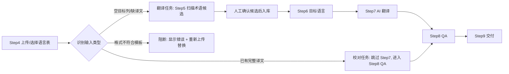
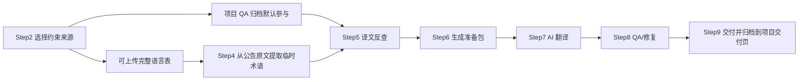

# Video UX and Flow Fixes Implementation Plan

> **For agentic workers:** REQUIRED SUB-SKILL: Use superpowers:executing-plans to implement this plan task-by-task. Steps use checkbox (`- [ ]`) syntax for tracking.

**Goal:** 修复真实录屏和用户截图暴露的状态错位、流程入口不清、QA/交付闭环弱、错误提示不可读问题，让主翻译、公告、术语、项目删除在脱离 Codex 的工作台里可连续完成。

**Architecture:** 先收口项目级状态刷新和错误映射，再按用户操作路径重排 Step4/5/7/8/9 的 UI 层级。后端只补必要的 guardrail 和 artifact/download 校验，不重写核心 workflow。

**Tech Stack:** FastAPI + SQLite 后端，React/TypeScript/Vite 前端，Playwright E2E，pytest/ruff/compileall 验证。

---

## 0. 已确认问题清单

1. 术语导入/新增显示成功，但项目概览术语页仍 0 行：项目快照刷新可能串项目或刷新旧项目。
2. 删除项目失败显示 `project not found`：删除弹窗拿到的是过期项目对象，404 被当作失败暴露给用户。
3. 主翻译 Step4/5 逻辑不清：用户不知道 Step4 传的是待翻译空表、已翻译校对表，还是完整语言表；Step5 却要求完整语言表扫描术语候选。
4. Step5 高频词扫描失败时暴露 Pydantic/raw JSON，缺少“先选语言表/格式不对”的人话提示。
5. Step7 公告 AI 翻译页过多展示 Workpack/Prompt/AI response，正常 API 翻译路径反而不突出；按钮文案应只叫“AI 翻译”。
6. Step8 QA 页把历史、运行状态、修复按钮、上传框混在一起；用户点击后看不到清晰进度，失败后不知道在哪里修。
7. Step9 / 项目交付页闭环弱：有任务记录但下载 404；失败或未生成交付时缺少“重新生成/去 QA/去翻译”的明确入口。
8. 状态条、toast、顶部状态会展示 raw command / traceback / HTML 413 / Internal Server Error，不适合给组内用户看。

## 1. 文件边界

**前端主要改动：**
- `D:\codex\localization-workflow-studio\frontend\src\main.tsx`
  - 项目快照刷新、项目删除弹窗、全局状态映射、页面装配。
- `D:\codex\localization-workflow-studio\frontend\src\components\translationWizard\TranslationWizard.tsx`
  - 主翻译 Step4/5/7/8/9 的文案、按钮层级、运行状态与下一步动作。
- `D:\codex\localization-workflow-studio\frontend\src\components\announcement\AnnouncementWorkflow.tsx`
  - 公告 Step2/4/5/7/8/9 的同类层级整理。
- `D:\codex\localization-workflow-studio\frontend\src\apiClient.ts`
  - 用户可读错误映射，屏蔽 raw JSON/HTML/traceback。
- `D:\codex\localization-workflow-studio\frontend\src\styles.css`
  - 只做必要布局：主操作按钮、折叠高级区、空态 CTA、进度区。

**后端主要改动：**
- `D:\codex\localization-workflow-studio\backend\app\routers\glossary.py`
  - 术语导入/候选确认后返回明确结果，格式错误返回人话 message。
- `D:\codex\localization-workflow-studio\backend\app\routers\runs.py`
  - Step5 缺 `input_artifact_id` 等校验映射为 workflow input error。
- `D:\codex\localization-workflow-studio\backend\app\routers\delivery.py`
  - 下载前校验 artifact 存在；缺文件时返回可处理提示而不是裸 404。
- `D:\codex\localization-workflow-studio\backend\app\routers\projects.py`
  - 删除项目 404 可作为幂等删除处理。
- `D:\codex\localization-workflow-studio\backend\app\schemas.py`
  - 必要时补 `user_message` / `next_action` 字段，不破坏旧响应。

**测试：**
- `D:\codex\localization-workflow-studio\frontend\e2e\studio-ui-flow.spec.ts`
- `D:\codex\localization-workflow-studio\backend\tests\test_*.py`

## 2. 用户路径重排规则

### 主翻译 Step4/5 分流



### 公告 Step2/4/5/7 分流



## 3. 实施任务

### Task 1: 项目状态与删除幂等收口

- [ ] 在 `main.tsx` 中确认所有术语/归档/候选操作都使用操作时捕获的 `projectId` 刷新快照，不使用可能过期的 `currentProject`。
- [ ] 删除项目时，如果后端返回 404，把它当作“项目已不存在”，关闭弹窗并刷新项目列表。
- [ ] 删除弹窗打开期间，如果项目列表里已没有目标项目，自动关闭弹窗。
- [ ] 增加 Playwright 用例：创建临时项目 → 打开删除弹窗 → 后台/接口先删 → 前端确认删除 → 弹窗关闭，状态为“项目已删除/已刷新”。

### Task 2: 术语页导入后立即可见

- [ ] 在术语导入、手动新增、编辑、删除、候选确认后统一调用 `refreshProjectSnapshot(projectId)`。
- [ ] 状态条只显示“术语已导入 X 条（LANG）”，表格数据必须来自刷新后的宽表，不用本地猜测。
- [ ] 如果刷新后仍 0 行，显示“导入成功但未找到可展示语言列，请检查模板表头”，并提供“查看导入文件”入口。
- [ ] 增加 E2E：上传 3 条术语模板 → 点击导入 → 概览术语页出现 3 行。

### Task 3: Step4 输入类型判定与替换旧错误文件

- [ ] Step4 上传后立即显示判定结果：`待翻译表` / `已翻译校对表` / `完整语言表` / `格式错误`。
- [ ] 格式错误不进入下一步，不污染资产选择；显示“重新上传替换当前文件”。
- [ ] 已翻译表默认建议进入 Step8 QA，提供“仍作为待翻译表处理”的次级选项。
- [ ] 待翻译表进入 Step5，完整语言表可用于 Step5 术语扫描。
- [ ] 增加后端校验错误映射：缺 `input_artifact_id` 时返回“请先在 Step4 选择语言表”。

### Task 4: Step5 术语候选页降噪

- [ ] 页面主按钮只保留“扫描术语候选”。
- [ ] AI 漏词补充默认自动跑，但只显示一句状态：“已自动检查漏词 / 未配置 API，仅本地扫描”。
- [ ] “补齐缺失译文”“查看补充策略”移入高级折叠区。
- [ ] 扫描成功后显示三件事：候选数、待确认数、已入库数。
- [ ] 候选表操作文案改成“加入项目术语库 / 跳过候选”，避免用户误解为已经入库。

### Task 5: Step7 AI 翻译改成单主路径

- [ ] 主按钮文案统一为“AI 翻译”。
- [ ] 正常 API 已配置时，不展示上传 `ai_response` 作为主流程；外部 response 只放“高级：离线导入”。
- [ ] 进度区显示人话：`正在翻译：第 n/m 批，已完成 x/y 行`。
- [ ] 完成后自动选择输出译文，并提示“下一步：QA 校对”。
- [ ] 暂停按钮显示为“暂停”，恢复显示为“继续翻译”，不要显示后台状态码。

### Task 6: Step8 QA 运行、失败、修复路径重排

- [ ] QA 页只保留当前任务操作：输入文件、运行 QA、进度、问题摘要、修复/继续。
- [ ] QA 历史移到底部折叠区或项目概览，不放在当前操作区。
- [ ] QA 运行中禁用重复点击，显示“正在校对：已检查 x/y 行”。
- [ ] QA failed 时显示前 5 条可读问题样例，并给两个明确按钮：`AI 修复并重跑 QA`、`下载问题报告`。
- [ ] 如果允许带问题交付，按钮必须写清楚“生成带问题摘要的交付包”，不默认绕过 QA。

### Task 7: Step9 与项目交付页闭环

- [ ] Step9 生成交付后，把任务标记为 completed/delivered，并写入项目交付列表。
- [ ] 项目交付页只展示：任务名、语言、完成时间、状态、下载最终译文、下载修改记录/QA 摘要、重新生成。
- [ ] 过程产物默认折叠，不混在最终交付里。
- [ ] 下载前检查 artifact 文件存在；不存在时显示“文件缺失，请重新生成交付文件”，不要跳到 `{"detail":"Not Found"}` 页面。
- [ ] 增加 E2E：完成一个翻译/QA run → 项目交付页出现下载按钮 → 下载接口返回 200。

### Task 8: 错误提示统一

- [ ] `apiClient.ts` 增加 `toUserMessage(error)`：识别 HTML 413、Pydantic missing field、Internal Server Error、Not Found、traceback、command failed。
- [ ] 顶部状态条只显示用户动作相关信息：上传失败/格式不对/API 未配置/文件太大/交付文件缺失。
- [ ] 原始错误只进控制台或后台日志，不进入 UI 主状态条。
- [ ] 增加 E2E：模拟 413 和 missing field，UI 不显示 `<html>`、`traceback`、`Field required`。

## 4. 验收命令

每批改完必须跑：

```powershell
cd D:\codex\localization-workflow-studio
python -m pytest -q
python -m compileall -q backend workflow
python -m ruff check backend/app backend/tests --select E9,F
cd frontend
npm run build
npm run e2e -- --workers=1
```

禁用机翻路径扫描：

```powershell
cd D:\codex\localization-workflow-studio
rg -n -i "deep_translator|googletrans|GoogleTranslator|translate\.google|google translate|Google Translate|GOOGLE_TRANSLATE|google_trans" backend workflow frontend --glob "!frontend/node_modules/**"
```

## 5. 人工验收脚本

- [ ] 新建项目，上传项目资料，AI 分析后元信息能同步到项目概览。
- [ ] 上传术语模板，导入后术语表立即出现行。
- [ ] 上传错误语言表，Step4 显示格式问题并允许重新上传替换。
- [ ] 上传待翻译表，Step5 可扫描候选，候选确认后进入项目术语库。
- [ ] 点击 AI 翻译，看到进度，完成后进入 QA。
- [ ] QA 失败时能看到问题样例和修复入口。
- [ ] 生成交付后，项目交付页能下载最终文件，不出现 404 JSON。
- [ ] 删除项目失败/已删除时不会卡弹窗。

## 6. 提交策略

1. Commit A：状态刷新、删除幂等、术语导入可见性。
2. Commit B：Step4/5 输入判定和术语候选 UI。
3. Commit C：Step7/8/9 翻译、QA、交付闭环。
4. Commit D：错误提示统一和 E2E 回归。

每个 commit 前至少跑 `npm run build` 和相关 E2E；最后跑全量验证。
