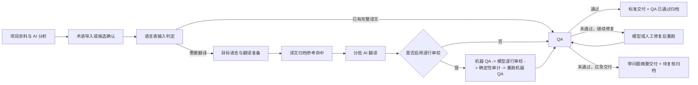

# GPT-5.6 Sol 前端整体优化计划（2026-07-10）

> 目标：全面优化配色、设计风格、信息架构、业务流程呈现、组件 UI、响应式和可访问性，同时保持界面简洁，保留完整翻译、快速任务、QA、归档、公告和交付能力。
> 当前阶段：只产出研究、设计系统和实施计划，不修改前端业务代码。
> 历史关系：`2026-07-08-frontend-optimization.md` 的 F1-F4 已基本完成。本计划从当前 `v1.2.0` 继续，不重复旧的拆分和性能工作。

## 0. 结论

需要优化，而且不应再做零碎补丁。

当前前端的结构拆分、轮询性能和基础文案层已经合格，但产品呈现仍有四个核心问题：

1. **视觉仍像早期 AI 生成的深色工作台**：紫蓝粉渐变、玻璃层、深蓝背景、emoji 导航和大量卡片同时出现，状态色与品牌色竞争。
2. **真实业务语义与外显文案漂移**：后端已支持 QA 未清零时带问题交付并继续归档，多个页面仍写“QA 必须通过才能交付”。
3. **最新能力没有形成用户可见闭环**：正式翻译已经会注入译文归档参考，也支持可选逐行审校，但用户看不到参考命中、处理阶段和可信度。
4. **同一屏重复状态过多**：页头状态、步骤状态、右侧 QA 结论、任务提示、问题摘要同时争夺注意力；在 1125px 左右的常见窗口下，右栏挤压主区并产生换行、截断和弱主次。

本轮推荐方向是：**用中性浅色工作台替换深色渐变外观，保留现有业务模型，重做状态层级和流程呈现。** 不把产品改成营销站，不用大 Hero，不靠更多卡片制造“设计感”。

## 1. GPT-5.6 Sol 前端能力研究结论

研究时间：2026-07-10。来源仅使用 OpenAI 官方资料和当前 Codex 运行时能力说明。

### 1.1 官方确认的能力

- GPT-5.6 Sol 是 GPT-5.6 系列旗舰模型。OpenAI 将其描述为当前最强编码模型，并给出 Terminal-Bench、DeepSWE 和 Coding Agent Index 等长链路工程结果。
- OpenAI 单独列出 “A leap forward in design”：Sol 能根据高层方向生成有品位、易用、可工作的界面，并通过更强的计算机操作能力检查渲染结果、发现视觉和功能问题、继续修正。
- OpenAI 公布的合作方前端评测中，GPT-5.6 得分 4.4/5，高于 GPT-5.5 的 4.0 和 Claude 4.8 的 3.5；评价范围包含电商、仪表盘、产品界面、桌面与移动端响应式完成度。
- Codex 支持截图输入、代码理解、终端执行、浏览器检查和图像生成。前端能力的关键不是一次生成，而是“代码修改 -> 渲染 -> 截图 -> 视觉判断 -> 修正 -> 自动化测试”的闭环。
- `max` 适合单模型深度推理；`ultra` 默认协调四个 agent 并行，适合真正可拆分的复杂工作流。

官方资料：

- https://openai.com/index/gpt-5-6/
- https://openai.com/index/codex-for-almost-everything/
- https://learn.chatgpt.com/docs/codex/cli

### 1.2 对本项目的实际含义

Sol 可以提高这次优化的完成上限，但不能替代产品约束。正确使用方式是：

1. 给 Sol 当前截图、真实代码、流程状态和不可破坏的行为契约。
2. 先建立状态模型和设计系统，再改页面。
3. 每个批次都让 Sol 看真实渲染，不接受“代码看起来应该没问题”。
4. 同时验证桌面、1125px 窄桌面、平板和手机，不只看 1440px 成功截图。
5. 让自动化测试证明行为，用视觉审查判断层级、密度和观感。

不采用的方式：给一句“做得高级一点”后直接全量改 CSS。那会放大 Sol 的生成能力，也会放大风格漂移和功能回归。

### 1.3 实施时的模型配置建议

- 默认：`gpt-5.6-sol` + `max`，用于信息架构、状态合同、关键页面实现和最终视觉审查。
- 机械性替换：仍可由 Sol 低一档 effort 完成，但必须在同一设计合同下工作。
- `ultra`：不默认启用。只有用户明确允许多 agent，且任务可拆为互不写同一文件的“文案合同 / CSS 系统 / E2E 验证”等独立工作流时使用。
- 任何模式都不能跳过真实浏览器和现有测试。

## 2. 当前事实基线

### 2.1 仓库与版本

- Repo：`D:\codex\localization-workflow-studio`
- 分支：`master`
- HEAD：`5e67b44aaed63b853da34b03c7e3628f087cab10`
- 版本：`1.2.0`
- 工作树：计划开始前为 clean，`master...origin/master`
- 前端：React 19 + TypeScript + Vite 7 + 原生 CSS
- 当前构建：通过，90 modules transformed
- 主入口包：375.72 kB，gzip 115.26 kB
- CSS：62.88 kB，gzip 11.44 kB
- Playwright：25 条用例，覆盖完整流程、快速任务、公告、QA、交付、归档、并发提示和恢复

### 2.2 7 月 8 日计划完成度

已经完成，不应重复投入：

- `main.tsx` 和 `TranslationWizard.tsx` 单体拆分。
- 轮询去重、隐藏页暂停、AbortController。
- 热路径 memo、分支懒加载、历史分页。
- `uiText.ts`、应用内 ConfirmModal。
- 基础 CSS token、980/640 两档响应式。

仍然存在：

- `styles.css` 仍超过 3000 行，视觉规则与业务组件耦合。
- token 只是把旧配色变量化，没有改变深蓝、紫色渐变和玻璃卡片的视觉命题。
- 现有断点只看 viewport，不理解侧栏挤压后的主工作区实际宽度。

### 2.3 最新流程能力

正式翻译当前真实链路：



这张图必须成为前端状态模型，而不是只存在于后端代码和文档中。

## 3. 主要问题清单

### P0：业务语义冲突

后端真实规则：

- QA 通过后正常归档，`source_type=qa_passed`。
- QA 未通过但用户生成交付包时，也会归档，`source_type=delivered_with_issues`。
- 失败 QA 交付包含问题摘要，属于明确的应急路径，不等于 QA 已通过。

前端仍有旧口径：

| 位置 | 当前外显文本 | 问题 |
| --- | --- | --- |
| `ProjectTabs.tsx` 翻译页 | 必须修复问题为 0 才能交付 | 与应急交付冲突 |
| `ProjectTabs.tsx` 交付空态 | 先完成并通过 QA | 会让失败 QA 用户认为无法交付 |
| `StepTranslate.tsx` | QA 通过后交付 | 省略了带问题交付分支 |
| `StepSource.tsx` / `StepFreqV2.tsx` | QA 通过后写入归档并交付 | 省略交付时待复核归档 |
| `README.md` | hard issue 必须为 0；QA 通过后才归档 | 文档也已落后于后端 |

目标合同：

```text
正常标准：必须修复问题 = 0 -> 标准交付 -> 可信归档
应急例外：问题未清零 -> 带问题摘要交付 -> 待复核归档
```

### P0：QA 屏信息重复且主操作不稳

当前 Step 8 同时存在：

- WorkflowStepShell 顶部状态。
- 右栏 QA 结论卡。
- “建议处理”按钮组。
- “任务提示”卡。
- 主区运行状态。
- 问题摘要和推荐处理顺序。

结果是用户截图中红框区域占据大量宽度，却仍要从多处判断“未通过后该点哪个”。

目标：只保留一个 QA 结论区和一个动作优先级。

### P1：v1.2.0 新能力不可见

#### 译文归档参考

后端已有 `reference_audit`：

- `archive_entries`
- `total_rows`
- `reference_hit_rows`
- `reference_hits`
- 首次命中写入 run 快照，续跑保持稳定

当前前端没有类型、摘要或历史展示，用户无法确认历史译文是否真正参与本次翻译。

#### 深度逐行校对

当前只有 Step 7 一个 checkbox 和结束后一句摘要，缺少：

- 为什么开启。
- 大致额外耗时。
- 运行到机器 QA、模型审校、审计回退还是重跑 QA。
- 失败后如何恢复。
- 审校结果与普通 QA 的关系。

### P1：流程导航仍按内部步骤平铺

- 完整流程和公告流程都显示 9 个平级按钮，用户需要理解所有步骤后才能判断当前位置。
- 已译表会跳过多个步骤，但导航没有明确“已跳过”。
- 语言多选与“当前执行语言”混在同一个按钮里，并依赖双击语义，不够直观。
- 项目概览同时有顶部 CTA、统计卡、后台任务、公告面板、六个 Tab 和侧栏快捷入口，首屏焦点分散。

### P1：响应式判断过晚

- 当前工作区双栏只在 viewport 小于 980px 时折叠。
- 1125px 视口仍要扣除 260px 侧栏和页面 padding，主区实际已经不足以容纳正文和右栏。
- 结果是状态 badge 换行、事实卡内容截断、按钮拥挤。

### P2：视觉语言不适合运营工作台

- 大面积深蓝、紫色、粉色、绿色同时成为主色。
- 顶栏、主按钮、选中项和进度条使用多组渐变。
- 卡片圆角 10-16px，玻璃透明层和 blur 使页面像展示型概念稿。
- 26 行 TSX 带 emoji，按钮和标题视觉符号不统一。
- 多层卡片和状态卡降低扫描效率。

## 4. 目标体验

### 4.1 一句话目标

用户打开任何页面，都能先看到“现在处于什么状态”和“推荐点什么”，然后再决定是否查看证据和高级选项。

### 4.2 全局信息架构

保留现有项目侧栏和业务能力，调整页面角色：

1. **项目概览**：下一步、运行中任务、最近结果。
2. **项目资产**：元信息、术语表、译文归档。
3. **任务执行**：完整流程、快速任务、公告流程。
4. **质量与交付**：QA、修复、交付文件。

六个项目 Tab 可以保留，但视觉上按“资产 / 执行 / 结果”分组，减少六个同级入口的认知负担。

### 4.3 四阶段流程模型

完整翻译的 9 步仍然存在，但分组显示：

| 阶段 | 真实步骤 | 用户问题 |
| --- | --- | --- |
| 准备 | 1 项目资料、2 AI 分析、3 术语表 | 这次翻译依据是否齐全？ |
| 输入 | 4 判定输入、5 术语候选、6 目标语言 | 这份文件走哪条路径？ |
| 处理 | 7 AI 翻译、8 QA 校对 | 当前任务做到哪里、是否要修？ |
| 交付 | 9 交付 | 下载什么，归档是否可信？ |

公告 9 步使用同一阶段框架，不改后端步骤号。

快速任务保持 3 步，不向完整流程靠拢。

## 5. 页面级优化方案

### 5.1 应用框架和配色

采用 `DESIGN.md` 的 Quiet Localization Operations 方向：

- 白色主工作面、浅灰页面底、石墨文本、青绿色主操作。
- 蓝色只表示运行与信息，绿色只表示通过，黄色只表示待复核，红色只表示阻断。
- 移除顶栏渐变、全屏深蓝渐变和 backdrop blur。
- 主区不再漂浮在大圆角玻璃容器中。
- 移除装饰 emoji；命令图标统一为 `lucide-react` 16px。
- 首轮只做浅色主题，暗色不并行。

### 5.2 顶栏和项目侧栏

- 产品名缩短为“本地化工作台”，英文名放 title 或关于信息。
- 全局状态只在有任务运行、容量冲突或版本异常时出现。
- 设置、活跃任务使用图标按钮和 tooltip。
- 项目侧栏只显示项目名称、必要状态点和新建按钮；快捷入口移动到当前项目主区，避免全局与项目动作混在一起。
- 删除“长按取消/删除”作为唯一发现方式，保留右键或更多菜单的明确入口。

### 5.3 项目概览

第一屏改为：

1. 当前项目名称与一个主 CTA。
2. “推荐下一步”状态带，例如“修复 2 个 QA 阻断”。
3. 运行中或失败待处理任务。
4. 最近一次交付或归档结果。

现有四个统计卡不全部保留为大按钮：

- “可交付”和“QA 阻断”保留为有行动意义的状态。
- “语言包任务”“公告任务”“已归档文本”降为简洁数字或 Tab 计数。

### 5.4 步骤导航

- 4 个阶段作为一级进度。
- 当前阶段内显示真实步骤。
- 已译表判定后，步骤 5-7 标记“已跳过”，直接突出 QA。
- 非当前阶段步骤可查看，但不让用户误以为必须逐个点击“下一步”。
- 移动端只显示“阶段 3/4 · QA 校对”和前后按钮。

### 5.5 Step 1-6 准备与输入

- Step 1、2、3 合并视觉语言：输入区、状态摘要、主操作、折叠证据。
- AI 分析的 5 个 metric card 改为一行摘要和可展开明细。
- Step 3 模板错误保持就地修复：错误原因、正确列、模板下载、重新上传在一个输入区。
- Step 4 判定结果直接改变步骤导航，并明确“将跳过哪些步骤”。
- Step 5 候选表保留编辑能力，默认只显示待处理项；扫描统计收敛为一句摘要。
- Step 6 将“多选语言”和“当前预览语言”拆成明确控件，不再依赖双击。

### 5.6 Step 7 翻译

主区只保留：

1. 输入文件和目标语言。
2. 运行阶段和进度。
3. 开始、继续或暂停。
4. 阻断原因。

新增“本次翻译依据”摘要：

```text
项目提示词：已生成
项目术语：30 条，本次命中 12 行
历史译文：217 条可参考，本次命中 28 行 / 31 次
深度逐行校对：已开启 / 未开启
```

`reference_audit` 结束后可见；运行前只展示归档可用总量，不伪造命中数。

逐行校对改为“质量增强”开关：

- 默认关闭。
- 标签旁显示“额外耗时，适合最终交付前深校”。
- 开启后显示四阶段：机器 QA、模型审校、确定性审计、重跑 QA。
- RunDetail 展示审校行数、建议数、审计回退数、最终采纳数。
- 审计 JSONL 仍放高级审计区，不进入主交付下载。

### 5.7 Step 8 QA

只保留一个结论区：

#### 未运行

- 结论：等待运行。
- 主操作：运行 QA。
- 辅助：选择或上传译文表。

#### 运行中

- 结论：正在检查变量、标签、术语、中文残留和格式。
- 只显示进度和取消/等待，不显示修复与交付按钮。

#### 已通过

- 结论：QA 已通过。
- 主操作：生成标准交付。
- 次操作：下载校对后译文、修改记录。

#### 未通过

- 结论：X 个必须修复，Y 个建议修复。
- 主操作：模型修复并重跑 QA。
- 次操作：手动修复。
- 风险操作：生成带问题摘要的交付。

“带问题交付”不得和修复按钮同色同权重；必须明确：

- QA 状态仍为未通过。
- 交付会附 QA 摘要。
- 译文会写入“待复核归档”。

问题列表默认按“必须修复”排序；支持“全部 / 可网页修复 / 只能看报告”筛选。

### 5.8 Step 9 与项目交付页

- 合并“生成”和“下载”心智：未生成时显示一个主按钮；生成后原位置变为下载列表。
- 交付类型明确区分：标准交付、带问题摘要交付、多语言合并交付、公告交付。
- 每个任务只显示一个逻辑交付记录，继续按逻辑身份去重，不用 run_id 直接堆多份。
- 生成后显示归档回执：写入数量、来源标签、是否待复核。
- “完成”不再只是导航词，改为“返回项目交付页”。

### 5.9 译文归档

新增来源与可信度：

- 表格每个语言值带来源 badge。
- 筛选：全部、QA 已通过、人工维护、外部导入、待复核。
- `delivered_with_issues` 显示“带问题交付，待复核”。
- 翻译引用仍按服务端优先级；前端不重新排序。
- 空态文案改为：可导入已有译文；QA 通过会自动归档；带问题交付会进入待复核归档。

### 5.10 快速任务

- 保留三步，不塞入九步完整流程。
- Step 2 用一句真实摘要说明项目提示词、术语和译文归档会自动参与。
- 任务完成后展示本次实际使用的约束数量，不只写“自动带入”。
- 快速 QA 复用同一 QA 结论组件，避免另一套状态文案。
- 不在本轮给快速任务新增逐行审校开关，除非后端先建立同等合同。

### 5.11 公告流程

- 同样使用四阶段进度，保留九个真实步骤。
- Step 2 明确约束优先级：QA 已通过归档 > 人工维护 > 外部导入/待复核。
- 待复核译文可以作为补充参考，但不得以“QA 归档”笼统称呼。
- Step 7 使用同一任务进度组件。
- Step 8 统一 QA 结果组件，但公告目前的“问题不阻断交付包”语义必须单独标明，不和语言包 QA 合并成错误规则。
- 过程产物继续折叠，交付文件始终前置。

### 5.12 设置和全局任务

- 设置按“AI 服务 / 翻译批次 / 并发”分区，不显示本地配置文件名。
- 推理强度显示中文标签，并在详情中保留真实值。
- 活跃任务面板支持点击跳到对应项目和任务，不只显示列表。
- 同项目忙、全局容量满使用不同图标、文案和建议动作。

## 6. 实施架构

### 6.1 新增展示层合同

新增 `frontend/src/domain/workflowPresentation.ts`，集中处理：

- QA 结论、推荐动作和交付模式。
- run 阶段与步骤状态。
- 归档来源标签和可信度。
- `reference_audit` 摘要。
- 逐行审校阶段与摘要。

原则：组件不自行拼接业务结论；相同 run 在项目概览、Step 8、历史详情和交付页必须得到同一结论。

### 6.2 新增共享组件

建议最小集合：

- `PhaseStepper.tsx`
- `TaskStatusBanner.tsx`
- `TaskEvidenceSummary.tsx`
- `QaOutcomePanel.tsx`
- `ArchiveProvenanceBadge.tsx`
- `DeliveryResult.tsx`

不引入大型 UI 组件库。图标只新增 `lucide-react` 一个轻量依赖。

### 6.3 CSS 拆分

保留 `frontend/src/styles.css` 作为入口，拆为：

```text
frontend/src/styles/tokens.css
frontend/src/styles/base.css
frontend/src/styles/shell.css
frontend/src/styles/components.css
frontend/src/styles/workflow.css
frontend/src/styles/tables.css
frontend/src/styles/responsive.css
```

拆分与视觉替换同批完成，避免先做纯搬家再重复修改。

### 6.4 类型补齐

在 `frontend/src/types.ts` 增加：

- `ReferenceAuditState`
- 完整的 `LineProofreadState.status`
- 归档来源联合类型
- 任务展示状态类型

后端字段缺失时显示“暂无数据”，不以 0 冒充真实结果。

### 6.5 非破坏性数据补充边界

本计划以现有 API 和 run metadata 为主。若快速任务或公告任务缺少“本次实际使用了多少术语/归档参考”的只读摘要，允许后端补充非破坏性 metadata 字段和响应类型，但不得改变翻译、QA、归档或交付规则。前端不得读取内部 workpack 文件后自行推断业务结论。

## 7. 分阶段实施计划

### 阶段 A：状态与文案合同，P0

目标：先修正说错话的问题，不等视觉改造完成。

改动：

- 建立 `workflowPresentation.ts`。
- 统一 QA 通过、QA 未通过、带问题交付、归档来源文案。
- 修复当前 11 处旧 QA 口径，保留公告中真正只指“QA 已通过归档”的场景。
- 更新 README 主流程和质量门槛。
- 新增无依赖脚本 `frontend/scripts/check-ui-copy.mjs`，阻止旧禁用文案和裸状态枚举回流。

验收：

- 失败 QA 页面明确存在修复和应急交付两条路径。
- 任何页面都不再声称失败 QA 完全不能交付或不能归档。
- 标准交付与带问题交付不混称“QA 已通过”。

### 阶段 B：设计系统与应用框架，P1

目标：替换视觉命题，不改核心业务动作。

改动：

- 落地 `DESIGN.md` token。
- 改为浅色中性工作台。
- 移除渐变、玻璃、blur 和大圆角。
- 统一按钮、输入、状态、表格、弹窗和 focus。
- 用 lucide 替换命令 emoji。
- 调整顶栏、侧栏、项目概览第一屏。

验收：

- 页面主色不再是紫蓝粉渐变。
- 一个区块只有一个主按钮。
- 无嵌套卡片视觉。
- 3 秒内可定位下一步主操作。

### 阶段 C：流程导航与输入分流，P1

目标：九步完整能力不变，但用户不再承担九个平级步骤的认知负担。

改动：

- 新增四阶段 stepper。
- 显示完成、当前、跳过、需要处理四类步骤状态。
- 已译表分流时明确跳过 5-7。
- 重做语言多选与当前语言控件。
- 准备/输入步骤减少重复 metric card 和说明段落。

验收：

- 待翻译表和已译表从 Step 4 后得到不同且准确的导航状态。
- 用户无需手动点击被跳过步骤。
- 移动端不显示九个拥挤按钮。

### 阶段 D：Step 7 最新能力融合，P1

目标：让译文归档参考和逐行审校成为可理解、可核验的产品能力。

改动：

- 透出 `reference_audit` 和 run 快照来源。
- 增加翻译依据摘要。
- 将逐行审校改为质量增强区，显示耗时提示和处理阶段。
- 历史详情显示参考命中与逐行审校摘要。
- 多语言卡只显示有状态变化的语言，完成项可折叠。

验收：

- 有归档命中的 run 可看到可用条目、命中行和命中次数。
- 无命中时明确“未命中”，不误写“未使用”。
- 开启逐行审校后能看到四阶段和最终统计。

### 阶段 E：QA、交付、归档闭环，P0/P1

目标：彻底解决用户最容易卡住的 QA 清零和交付归档理解问题。

改动：

- 用 `QaOutcomePanel` 替换重复的 QA 状态块。
- 未通过时主推修复，次推带问题交付。
- 交付生成后显示归档回执。
- 归档表增加来源、可信度筛选和 badge。
- 交付列表按逻辑任务去重并显示丰富记录。

验收：

- 失败 QA 可在两次明确点击内生成带问题交付。
- 生成后可看到 QA 摘要下载和“待复核归档”回执。
- 修复并通过后，同一逻辑任务显示最新可信交付，不堆重复卡片。

### 阶段 F：项目概览、快速任务、公告、设置统一，P1/P2

目标：完成全产品一致性，避免只有完整流程变好。

改动：

- 项目概览以推荐下一步为中心。
- 快速任务复用状态和证据组件。
- 公告流程使用四阶段导航和来源可信度。
- 设置和活跃任务使用统一组件和中文状态。

验收：

- 三条任务入口使用相同状态词和视觉语义。
- 公告独有 QA 语义不被语言包规则覆盖。
- 项目概览只有一个最强主 CTA。

### 阶段 G：响应式、可访问性、视觉收口，P1

目标：真实视口可用，不以 1440px 单图宣布完成。

改动：

- 工作区容器查询，主区小于 980px 时右栏下移。
- 1125、768、390 视口逐页检查。
- 键盘、焦点、ARIA、触摸目标、reduced motion。
- 可选引入 `@axe-core/playwright` 作为开发依赖，阻断 critical/serious 问题。
- Sol 对同状态前后截图做视觉审查并迭代。

验收：

- 指定四个视口无页面级横向滚动、文本截断、按钮溢出和状态重叠。
- 键盘可走通上传后导航、QA 修复和交付生成。
- 关键页面无 axe critical/serious。

## 8. 测试与视觉 QA

### 8.1 保留现有门禁

```powershell
npm --prefix frontend run build
npm --prefix frontend run e2e -- --workers=1
python -m pytest backend/tests/test_workflow_e2e.py backend/tests/test_risk_hardening.py backend/tests/test_reference_archive_injection.py backend/tests/test_line_proofread.py -q
python -m ruff check backend/app backend/tests scripts --select E9,F
python -m compileall -q backend workflow scripts
```

### 8.2 新增 E2E

至少新增 7 条：

1. 失败 QA 展示修复主路径和带问题交付次路径。
2. 带问题交付生成后显示 QA 摘要和待复核归档来源。
3. QA 修复通过后显示标准交付和 QA 已通过归档。
4. 正式翻译显示真实 `reference_audit` 命中摘要。
5. 开启逐行审校后显示处理阶段和最终摘要。
6. 已译表分流后，步骤 5-7 标记为跳过并直达 QA。
7. 1125x903 与 390x844 关键页面无溢出和不可见主操作。

### 8.3 视觉审查矩阵

每个视口至少捕获：

- 项目概览。
- Step 3 模板错误。
- Step 7 运行中与完成。
- Step 8 未通过与通过。
- Step 9 标准交付与带问题交付。
- 译文归档来源筛选。
- 快速任务。
- 公告翻译。
- 设置和活跃任务面板。

截图保存到：

```text
docs/superpowers/reports/frontend-visual-qa-2026-07/
```

硬检查：

- DOM overflow 和重叠断言进入 E2E。
- 像素截图先作为 PR 审查产物，不立即做跨平台 CI 硬门禁，避免字体渲染差异造成噪音。
- Sol 必须同时看到修改前和修改后截图，再给出保留、回退或继续修正结论。

## 9. 提交与回滚策略

建议分支：`codex/frontend-f5-sol-ux`

建议提交：

1. `docs(frontend): define design and workflow presentation contract`
2. `fix(ui): align QA delivery and archive semantics`
3. `style(ui): apply quiet localization workbench system`
4. `feat(ui): group workflow phases and skipped steps`
5. `feat(ui): surface archive references and line proofreading`
6. `feat(ui): unify QA delivery and archive outcomes`
7. `feat(ui): align overview quick and announcement flows`
8. `test(ui): add responsive accessibility and workflow gates`

每个提交都必须可单独 build。阶段 A、D、E 改到业务状态，必须跑对应后端聚焦测试；纯视觉阶段至少跑 build 和相关 E2E。

不直接在 `frontend-v2` 上继续开发，也不拿它替换主入口。它只作为已验证的“浅色、简洁、单一下一步”参考；当前主前端已经包含更多 v1.2.0 能力，应在 `frontend/` 内完成融合。

## 10. 完成标准

- [ ] 配色、字体、间距、圆角、按钮、输入、状态、表格和弹窗遵守 `DESIGN.md`。
- [ ] 无紫蓝粉渐变、玻璃模糊、装饰 emoji 和嵌套卡片。
- [ ] 项目概览、完整流程、快速任务、公告、QA、归档、交付和设置全部完成统一。
- [ ] 完整流程仍保留 9 个业务步骤，但以 4 阶段清晰呈现。
- [ ] QA 通过与带问题交付语义全仓一致。
- [ ] `reference_audit` 和逐行审校成为可见、可核验能力。
- [ ] 译文归档显示来源可信度，`delivered_with_issues` 明确标记待复核。
- [ ] 1125x903 和 390x844 无关键文本截断、按钮溢出和状态重叠。
- [ ] 现有 25 条 E2E 全绿，新增至少 7 条全绿。
- [ ] 前端 build、后端聚焦测试、Ruff 和 compileall 全绿。
- [ ] 每个主要页面都有修改前后截图和 Sol 视觉审查记录。

## 11. 明确不做

- 不重写后端工作流和 API 业务语义。
- 允许为现有流程补充只读展示 metadata；不允许借 UI 优化改变任务结果。
- 不删除完整流程、快速任务或公告能力。
- 不在本轮同时做暗色主题。
- 不引入大型 UI 库、状态库或路由库。
- 不把过程审计文件塞进最终交付区。
- 不为了视觉统一，把公告 QA 和语言包 QA 的不同交付规则错误合并。
- 不以静态设计图或单一桌面截图代替真实浏览器验收。
