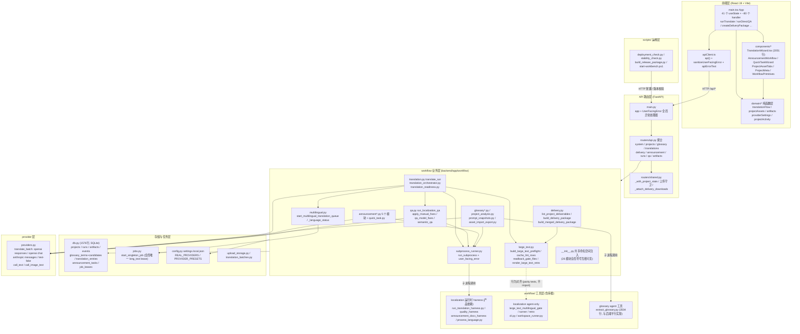
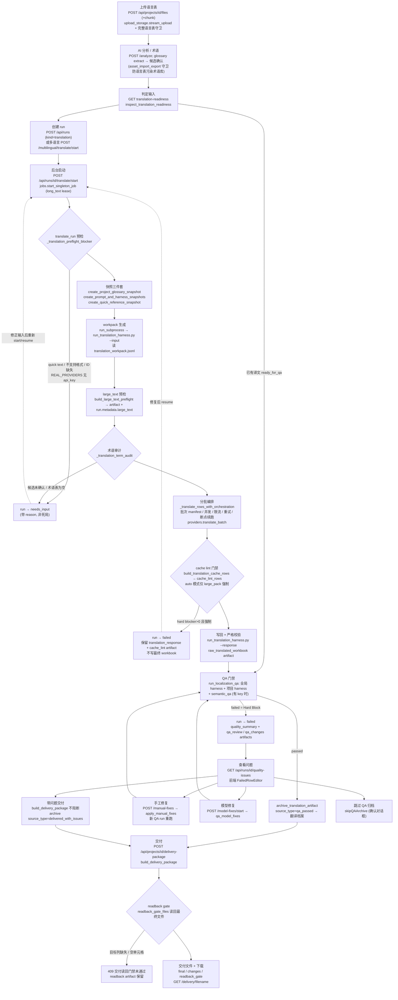
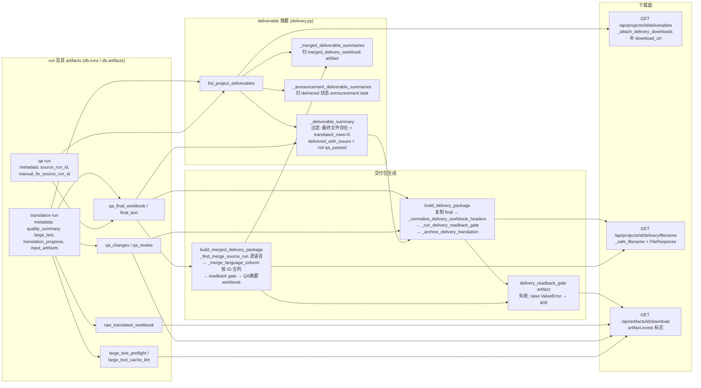

# 架构检视报告（2026-07-08）

- 检视对象：`D:\codex\localization-workflow-studio`，分支 `codex/fable5-full-audit-refactor`，HEAD `5bf0af0`（另含未提交的 delivery readback gate 改动：`backend/app/workflow/delivery.py`、`large_text.py`、两个测试文件）。
- 检视方式：只读通读 `backend/app/routers/*`、`backend/app/workflow/*`、`backend/app/{db,jobs,providers,config,errors,main}.py`、`frontend/src/main.tsx` 与 `components/*`、`domain/*`、`workflow/localization` 与 `workflow/glossary` 工具层、`scripts/*`，并对 `workflow/__init__.py` 的共享命名空间行为做了运行时验证（未修改任何文件）。
- 输入基线：`fable5-audit-report.md`（候选 A-F 及批准/延后决策）、`fable5-final-report.md`、`CONTEXT.md`、`2026-07-07-large-text-workbench-productization.md`。

---

## 任务一：架构拆分与流程图

### 1. 分层总架构图

依赖方向自上而下；关键跨层 seam 用真实模块/函数名标注。两个需要注意的事实：

- `workflow/localization` 并非纯 agent 工具层：`run_translation_harness.py`、quality/announcement harness 是产品运行时依赖，由 `subprocess_runner.run_subprocess` 以子进程方式调用；真正 agent-only 的是 `large_text_multilingual_gate/runner/retro` 三件套和 `cli.py`/`workspace_runner.py`。
- `backend/app/workflow/__init__.py` 把全部 26 个 workflow 子模块的全局符号合并进一个共享命名空间并回注每个模块（保留旧单文件行为），routers 因此可以 `from ..workflow import 任意函数`。这是一个隐藏的全局 seam，见任务二 N-1。

### 2. 核心用户流程图：正式翻译从上传到交付（含 QA hard block 恢复分支）

对应真实调用链：`main.tsx upload/runTranslate` → `routers/runs.py translate_start` → `jobs.start_singleton_job` → `translation.translate_run` → `qa.run_localization_qa` → `delivery.build_delivery_package`。多语言队列走 `multilingual.start_multilingual_translation_queue`，逐语言复用同一条 `translate_run` 链路。

### 3. 交付 / QA 数据流图：run → artifact → deliverable 摘要 → 下载

---

## 任务二：结构优化点检视

### 2.1 延后候选复核（C / E / F）

**候选 C：provider readiness（维持 DEFERRED，P2，不变）**
"provider 是否可用于正式任务" 仍分布在四处：`frontend/src/domain/providerSettings.ts` 的 `FORMAL_AI_PROVIDERS`（含 test-fake）、`TranslationWizard.formalTranslationBlockReason`、`translation.py` 预检的 `REAL_PROVIDERS + api_key`、`routers/system.py /api/health` 的 `provider_configured`。本轮新增的 `config.test_provider_enabled()`（`LWS_ENABLE_TEST_PROVIDER` 环境开关）实际上是第五个语义点，但它把 "test-fake 可否进入正式路径" 收进了后端一处，方向正确。当前代码没有出现新的漂移事故，云+test-fake 政策依旧未定，维持延后合理。触发条件：下次任何一个 seam 需要改动时，顺手做后端 readiness 单一信号。

**候选 E：大文本产品 gate（状态已实质变化：从 DEFERRED 变为"收尾中"，剩余工作 P1）**
审计时的判断（"gate 只存在于 agent CLI，产品侧缺失"）已过时。产品化计划 Task 1–4 已落地：

- `backend/app/workflow/large_text.py`（465 行，新增）：preflight、cache lint（含数字/词量词/CJK 过滤/机器 token/required term）、readback gate、retro 渲染器，与 `workflow/localization/utils/large_text_multilingual_gate.py` 保持 port + parity tests（模块 docstring 明确 "workflow gate wins"）。
- `translation.py translate_run` 已接线 preflight artifact + cache lint 强制（auto 模式 large_pack 才阻断，失败保留 response 不写 workbook）。
- `multilingual._language_status` 已透传 `large_text` metadata；`schemas.py` 已加 `large_text_mode`。
- `delivery.py` 单交付与合并交付均已接 `_run_delivery_readback_gate`（当前为未提交改动，含 `REVIEW_ONLY_SHEET_TITLES` 对 harness 附表的豁免）。

**剩余缺口（即计划 Task 5–7）**：`render_large_text_retro` 只有实现和测试，`translation.py` 终态与 `delivery.py` 都没有调用它，也没有把 `readback_gate` 状态写回 `run.metadata.large_text`（合并交付 metadata 里是硬编码的 `{"status": "passed"}`，语义正确但只覆盖成功路径）；前端 `main.tsx` 未传 `large_text_mode: 'auto'`（后端 normalize 默认 auto，行为一致但契约是隐式的）；`types.ts` 已有 `LargeTextRunState` 类型但 TranslationWizard 没有任何大文本面板/RunDetail gate artifact 展示——用户看不到 gate 发生过；docs 未更新。这些是收尾工作而非新特性，建议作为该计划的完成项优先做掉，避免"半接线"状态长期存在。

**候选 F：main.tsx 拆分（维持 DEFERRED，P2，理由略有增强）**
`main.tsx` 现为 2288 行、41 个 `useState`、约 80 个 handler，`ProjectOverview` 也还内嵌其中；`TranslationWizard.tsx` 2051 行。与审计时相比没有恶化也没有改善。维持 "extract-on-touch" 策略，但指出一个具体时机：大文本计划 Task 6 本来就要改 `main.tsx`（传 `large_text_mode`）和 `TranslationWizard.tsx`（Step 7 面板），是做第一个领域 hook 试点（如 `useDeliveryActions` 或 `useLargeTextState`）的自然窗口，不必另起重构批次。

### 2.2 新发现问题

**N-1（P1，需架构决策）`workflow/__init__.py` 共享命名空间导致跨模块同名函数静默覆盖——已验证存在真实语义差异**
- 位置：`backend/app/workflow/__init__.py`（合并 26 个模块的全局符号后回注每个模块，并用 `_WorkflowPackage.__setattr__` 保持同步）。
- 问题：后加载模块的同名符号会覆盖先加载模块的实现，且覆盖是静默的。运行时验证发现 9 组顶层同名定义，其中 `_cell_text` 存在真实语义差异：`delivery.py:769` 定义的是 `str(value).strip()`，`qa.py:1053` 定义的是 `str(value)`（不 strip）；因 qa 在 `_MODULES` 中排在 delivery 之后，**delivery 实际运行的是 qa 的不 strip 版本**（已用解释器确认 `delivery._cell_text("  x  ") == "  x  "`）。`_merge_language_column` 用 `_cell_text` 做合并交付的 ID 匹配，原意是 strip 后比较——含前后空格的 ID 现在会静默跳过合并（不报错，只少合行，靠 readback gate 兜底才可能暴露）。其余 8 组（`_header_map`、`_harness_summary`、`read_jsonl`/`write_jsonl`、`naming` 与 `announcement_outputs`/`delivery` 的三组）目前是等价拷贝或委托，无行为差异，但同样机制下任何一次"只改其中一份拷贝"都会被覆盖吞掉。
- 建议：最小修复是给 `delivery.py` 的 `_cell_text`/`_header_map` 改名（如 `_merge_cell_text`），并加一个守卫测试：遍历 `_MODULES` 用 AST 断言顶层 def/class 无跨模块重名（白名单现有等价拷贝）。是否移除整个共享命名空间 hack 是架构决策——它是单文件拆分时保留旧全局行为的过渡设施，routers 依赖 `from ..workflow import X` 的扁平出口，直接拆除影响面大；建议先加守卫测试冻结现状，把"逐模块显式 import、最终删除 hack"列为独立 loop。
- 风险：改名本身极低风险（有 delivery/merged delivery 测试兜底）；不修则每次新增 workflow 函数都可能踩同名地雷。

**N-2（P2，无需架构决策）deliverable 摘要 shape 三处手工构造**
- 位置：`delivery.py` 的 `_deliverable_summary` / `_merged_deliverable_summaries` / `_announcement_deliverable_summaries`。
- 问题：三个函数各自手工拼同一个 dict shape（约 20 个 key），`delivered_with_issues` 的推导规则写了三遍（fable5 循环统一了字段名，但没有固定 shape）。前端 `DeliverableTask` 类型靠人工对齐。
- 建议：在 `schemas.py` 加一个 `DeliverableSummary` pydantic model（或 TypedDict + 单一构造函数），三处走同一个构造入口。纯加法改动，测试面现成。
- 风险：低。

**N-3（P2，建议记录为部署约束，暂不改）jobs.py 全局单任务模型**
- 位置：`backend/app/jobs.py`（`_LEASE_NAME = "long_text"` 全局唯一）+ `multilingual.py` worker 顺序逐语言执行。
- 问题：整个产品同一时刻只允许一个后台 AI 任务——翻译队列、QA 队列、公告翻译、model-fix 互斥；多语言队列内部也是串行（并发只发生在单 run 的批次层 `max_concurrent_batches`）。对单人本地工作台这是刻意的简化（限流、断点续跑、lease 恢复都建立在它之上），但云/多用户部署时是吞吐瓶颈，且 409 报错 "another long-text AI job is active" 会成为常态。
- 建议：本轮不改。在部署文档记录"单实例单任务"约束；若云多用户成为真实需求，再演进为 per-project lease（`db.job_leases` 表结构已支持按 name 区分，改动集中在 `_LEASE_NAME` 的粒度）。
- 风险：现在改反而破坏限流假设（provider RPM/token 限制是按全局单任务校准的）。

**N-4（P2，触碰时拆，不单独立项）db.py 单文件承载度**
- 位置：`backend/app/db.py`（1576 行）。
- 问题：schema init + projects/runs/artifacts/events + announcement tasks + job leases 属于合理的薄 CRUD；但 glossary 段（约 700 行，candidate 接受/拒绝、canonical 排序 `_choose_glossary_canonical`、`dedupe_project_glossary_terms`、bulk upsert 合并规则）和 translation entries 的 rank/dedupe 是业务规则住进了存储层——模块边界泄漏，改术语合并策略要动 db.py。
- 建议：不整体拆。下次术语功能需要改动时，把 glossary CRUD+规则抽成 `db_glossary.py`（或把规则上移到 `workflow/glossary.py`），一次只动一个域。
- 风险：现在拆没有行为收益，纯搬家；等待触碰时机。

**N-5（P2）run.metadata 读-改-写并发窗口**
- 位置：`translation.py` 多处 `db.update_run(run_id, metadata={**db.get_run(run_id).get("metadata", {}), ...})`；`translation_orchestrator._update_translation_progress`；`cancel_translation_run`（API 线程）。
- 问题：metadata 是整体替换式更新，后台 worker 线程与 API 线程（cancel、resume）对同一 run 并发读-改-写没有锁，理论上会丢字段（例如 cancel 写入 `cancel_requested_at` 与 worker 写入 progress 交错）。目前 cancel 同时写文件哨兵 `_translation_cancel_path` 兜底，所以取消本身不会丢，但 metadata 字段丢失是静默的。
- 建议：低成本方案是 db 层提供 `merge_run_metadata(run_id, patch)`（SQLite 单连接内 SELECT+UPDATE 事务），逐步替换 `{**get_run(...), ...}` 模式。不必一次替换全部调用点。
- 风险：低概率、难复现；属于"下次遇到灵异 metadata 丢失前先修"的预防项。

**N-6（P2，文档级）workflow/localization 的双重角色未在文档中区分**
- 位置：`AGENTS.md` 声明 "Codex/Agent 不是产品运行依赖"，但 `translation.py`/`qa.py`/`announcement*.py` 通过子进程调用 `workflow/localization/scripts/run_translation_harness.py` 等，是硬运行时依赖；agent-only 的是 gate/runner/retro/cli。
- 建议：在 `CONTEXT.md` 或 `docs/` 里显式二分："runtime harness scripts"（产品依赖，改动需跑 backend 测试）与 "agent-only tooling"（gate/runner/retro）。防止未来把 harness 当纯工具清理或随意改 CLI 参数破坏产品。
- 风险：无代码风险，纯认知债。

**N-7（P2）前端未传 `large_text_mode`、大文本状态对用户不可见**
- 位置：`frontend/src/main.tsx` `runTranslate`/`startMultilingualTranslationQueue`（请求体无 `large_text_mode`）；`TranslationWizard.tsx`（无大文本面板，RunDetail 不展示 gate artifacts）。
- 问题：后端已经在跑 preflight/cache lint/readback，失败时用户只看到 run failed + error 文案，看不到 gate 证据链；`types.ts` 里的 `LargeTextRunState` 是死类型。
- 建议：按产品化计划 Task 6 收尾（Step 7 面板 + RunDetail artifact 链接 + 显式传 auto）。与候选 F 的 hook 试点合并执行。
- 风险：低，纯展示层加法。

**N-8（P2，评估后维持现状）large_text.py 与 workflow gate 的双实现**
- 位置：`backend/app/workflow/large_text.py` vs `workflow/localization/utils/large_text_multilingual_gate.py`（parse_number_token/numeric_values/cache lint 规则几乎逐行对应）。
- 评估：这是计划文档明确选择的 "port + parity tests" 方案（避免产品 import 仓库根路径、避免 agent 文件系统假设进产品）。docstring 已声明 "如不一致以 workflow gate 为准"。**维持双实现是对的**，但要求：任何一侧改 lint 规则必须同步另一侧并扩 parity 测试——建议把这句写进两个文件头（product 侧已有，gate 侧没有）。
- 风险：漂移风险由 parity tests 承担，可接受。

### 2.3 不值得做的事

- **前端全局状态库重写（Redux/Zustand）**：行为只被 Playwright e2e 钉住，big-bang 重写回归成本远超收益；继续 extract-on-touch。
- **合并 `extract_glossary.py`（3504 行）与后端 glossary 实现**：上轮已裁决为平行的 agent 工具，边界已记录；收敛是独立的未来决策。
- **批量改写 ~180 处 router `HTTPException` 样板**：上轮候选 A 已用 app 级 `UserFacingError` handler 补住兜底 seam，逐点改写只有整齐度收益。
- **重构 delivery 存在性检查（`Path.exists()` 多处内联）**：审计候选 B 已判定 "已足够深"，有测试钉住，动它是负收益。
- **db.py 整体拆分**：见 N-4，只在触碰 glossary 域时拆一片。
- **让 `large_text.py` 直接 import workflow gate 模块**：会把仓库根路径和 agent 假设引入产品包，parity tests 方案更好。
- **现在就把 jobs.py 改成多任务并发**：见 N-3，限流模型建立在单任务假设上，无真实多用户需求前不动。
- **进一步拆 `announcement.py`（1077 行）**：已经拆成 5 个模块（segments/ai/outputs/shared/主模块），继续拆是纯搬家。

### 2.4 优化点一览表

| 编号 | 位置 | 问题 | 优先级 | 需架构决策 |
|---|---|---|---|---|
| E-剩余 | translation.py / delivery.py / main.tsx / TranslationWizard.tsx | 大文本产品化 Task 5-7 半接线：retro 未挂、readback 未写回 metadata、UI 无面板 | P1 | 否（计划已批准） |
| N-1 | workflow/__init__.py + delivery.py/qa.py | 共享命名空间同名覆盖，`_cell_text` 语义被换、合并交付 ID 匹配丢 strip | P1 | 是（是否移除 hack） |
| N-2 | delivery.py 三个 summary 构造 | deliverable shape 三处手写、规则重复 | P2 | 否 |
| N-3 | jobs.py + multilingual.py | 全局单任务模型是云部署吞吐瓶颈 | P2 | 是（云多用户才触发） |
| N-4 | db.py glossary/translation 段 | 业务规则住在存储层 | P2 | 否（触碰时拆） |
| N-5 | translation.py metadata 读改写 | 跨线程丢字段窗口 | P2 | 否 |
| N-6 | AGENTS.md / CONTEXT.md | localization 工具层双重角色未区分 | P2 | 否 |
| N-7 | main.tsx / TranslationWizard.tsx | large_text_mode 隐式默认、gate 对用户不可见 | P2（并入 E-剩余） | 否 |
| N-8 | large_text.py ↔ workflow gate | 双实现漂移风险 | P2（维持现状+双向注释） | 否 |
| C-复核 | providerSettings.ts / translation.py / system.py | readiness 四处 seam，维持延后 | P2 | 是（cloud+test-fake 政策） |
| F-复核 | main.tsx (2288行/41 state) | 巨型 App，维持 extract-on-touch | P2 | 否 |

### 2.5 最值得先做的 3 件事

1. **收尾大文本产品化（E-剩余 + N-7）**：把 `render_large_text_retro` 挂到 `translate_run` 终态、`_run_delivery_readback_gate` 后把 `readback_gate` 状态写回 `run.metadata.large_text`、前端 Step 7 面板 + RunDetail gate artifacts + 显式传 `large_text_mode: 'auto'`、更新 docs。理由：门禁已经在生产路径上跑但证据链断在中途，半接线状态最容易在下次改动中变成不一致。
2. **修复 N-1 同名覆盖**：重命名 `delivery.py` 的 `_cell_text`/`_header_map`（恢复 strip 语义的 ID 合并），并加 AST 守卫测试禁止 workflow 子模块顶层重名。理由：这是本次检视发现的唯一"已生效的静默行为替换"，且修复成本一个下午。
3. **N-2 deliverable shape schema 化**：单一 `DeliverableSummary` 构造入口替换三处手写 dict。理由：交付面是用户信任的最后一环，shape 漂移的历史教训（I-007）刚发生过，这是把上轮 marker 统一固化成结构保证的最小后续。
