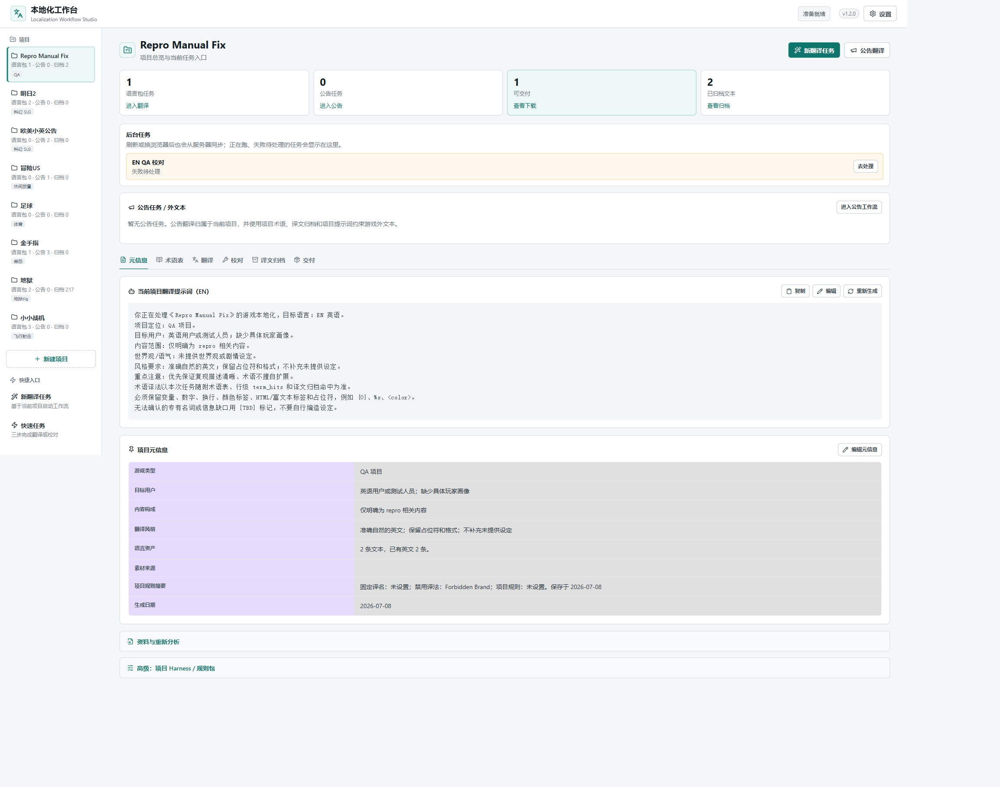
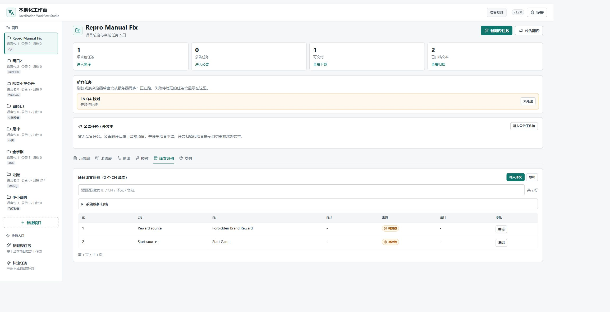
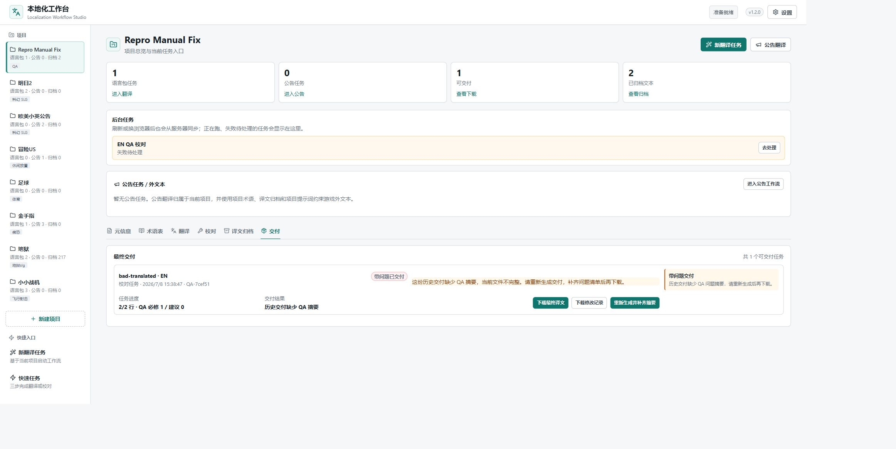
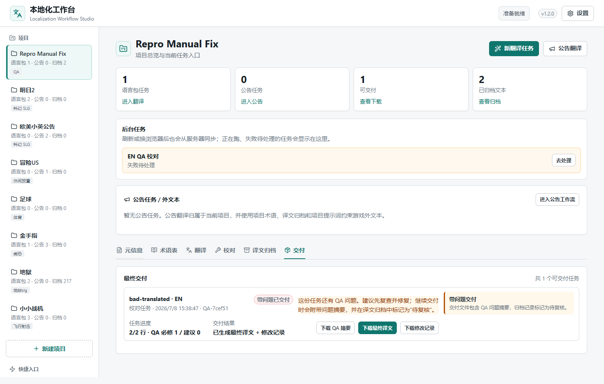

# 浏览器扩展与 Computer Use 验收报告

日期：2026-07-10

## 当前结论

- Chrome 新扩展已完成真实工作台主功能点验，页面无横向溢出、无浏览器控制台错误。
- 点验发现一项真实缺陷：历史“带问题交付”缺少 QA 摘要时，界面仍声称交付包含摘要。
- 缺陷已修复：现在明确标记交付不完整，并提供“重新生成并补齐摘要”；重建后 QA 摘要下载入口恢复。
- Windows 桌面 `computer_use` 尚未完成。Codex Desktop 已真实重启，但当前接管任务的来源仍是 `subagent`，该类型任务不会获得 Computer Use 所需的受信任 native pipe；不能用 Chrome 扩展的页面 CUA 冒充桌面验收。

## Chrome 扩展覆盖

| 功能区 | 结果 |
| --- | --- |
| 工作台壳层、版本、项目切换 | 通过 |
| 项目元信息、术语表、翻译、校对、译文归档、交付六个页签 | 通过 |
| 标准翻译工作流 Step 1-9 | 9/9 可访问，均无页面横向溢出 |
| 公告工作流 Step 1-9 | 9/9 可访问，交付包、五语言成品和 QA 摘要入口完整 |
| 快速任务 Step 1-3 | 3/3 可访问，缺少输入时启动按钮正确禁用 |
| 设置弹窗 | 字段、预设、推理强度和保存入口完整 |
| 新建项目弹窗 | 名称、类型、描述、取消和创建入口完整 |
| 历史带问题交付 | 缺摘要时正确阻断并提供重建入口；重建后恢复 3 个文件 |
| 下载 | QA 摘要和公告交付包均触发真实浏览器下载事件 |
| 浏览器日志 | 0 个 error / warning |

## 自动化回归

| 检查 | 结果 |
| --- | --- |
| 前端生产构建 | 通过，Vite 7.3.6，1644 个模块 |
| 完整前端 E2E | 27 项通过，`test-results/.last-run.json` 为 `passed` |
| 历史 QA 摘要缺失专项 E2E | 通过；覆盖删除摘要、显示阻断、重新生成和恢复下载 |
| npm audit | 0 个漏洞 |

## 截图证据

### 项目概览

### 译文归档来源

### 历史交付缺少 QA 摘要时的修复界面

### 重建后恢复 QA 摘要下载

全部截图位于 `docs/superpowers/reports/assets/browser-qa-2026-07-10/`。

## Computer Use 阻塞

`computer-use-client.mjs` 已安装。Codex Desktop 主进程已于 2026-07-10 16:53:26 重新启动，PID 也已更换；本地前后端在重启后继续返回 200。重启后的任务元数据仍明确显示 `thread_source=subagent`，同时 `nodeRepl.config`、`nodeRepl.nativePipe` 和 CUA 环境变量均未注入，因此阻塞属于任务权限边界，不是应用未重启。

要补完桌面验收，必须从顶层用户任务调用 Computer Use。待进入顶层任务后仍需执行：Chrome 窗口识别、桌面级点击、窗口截图和下载结果可见性检查。
