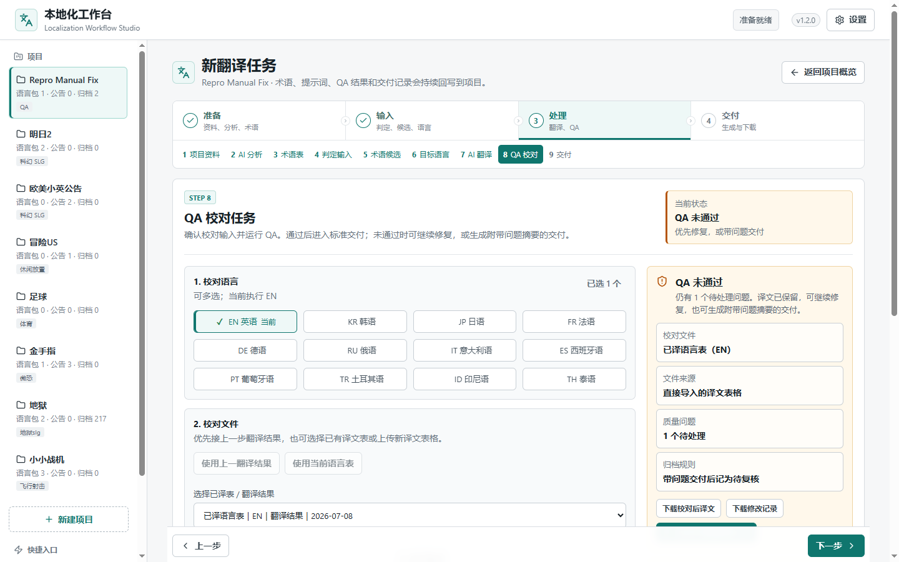
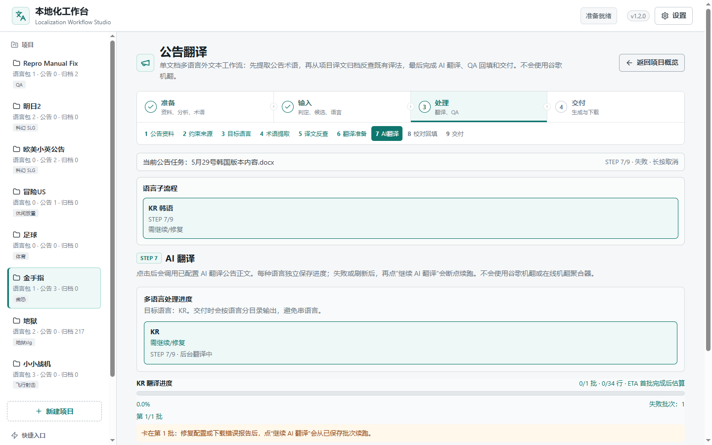

# Sites 前端优化与验收报告

日期：2026-07-10

分支：`codex/frontend-f5-sol-ux`

## 结论

本轮按 Sites 的“现有产品能力优化”路径继续收敛工作台，没有另建营销站，也没有迁移现有 React、Vite、Python API、上传和本地文件工作流。优化重点是首屏密度、长页导航、超宽屏可读性和视觉残留清理。

## 已完成

- 主工作区增加 `1600px` 最大内容宽度，超宽屏不再把状态和正文拉成过长信息线。
- 手机端四个项目统计入口改为 `2 x 2` 紧凑布局，首屏可继续看到后台任务和真实下一步。
- 项目功能标签在长页面滚动时保持吸顶，移动端仍可横向滑动，且不再暴露系统滚动条。
- 清理项目元信息表中遗留的紫色底，改为中性白色与浅青提示色。
- 清理术语候选表、公告语言与子流程选中态中遗留的紫色，统一为工作台青色状态。
- Step 8 校对文件改为“已译语言表（EN）”等简洁标签，不再暴露 `QA final workbook`、`result_en`。
- 公告资产名称改为“公告工作包 / 公告清单 / 公告提示词上下文”，多语言 QA 不再显示“workbook”。
- 表格缺少目标列时改为可执行的中文提示，明确返回“判定输入”重新选择语言表。
- 公告父任务已失败时，子流程不再错误显示“后台翻译中”，统一提示“需继续/修复”。
- 顶部运行状态增加无障碍实时播报。
- 新增站点图标、页面说明和主题色，消除浏览器 `favicon.ico` 404。

## 浏览器验收

- Chrome 扩展完成项目总览和交付页真实切换。
- 交付页只有 1 个结论区，QA 摘要下载入口为 1 个。
- Chrome 扩展控制台错误和警告均为 0。
- 扩展读取到的页面宽度与滚动宽度一致，无页面级横向溢出。
- Playwright CLI 留存 390、1440 和 2307 宽度截图，并复核 QA 与公告状态页无旧紫色、无横向溢出。
- Computer Use 的本地打包缺陷已修复：恢复 `%40` 作用域目录与 `%24` 文件名，补齐随包遗漏的 `tslib@2.8.1`；Sky 主模块已能完整导入。
- Computer Use 仍未执行：当前任务来源为 `subagent`，宿主未授予受信任 Windows 管道；没有绕过 Codex 审批边界或用其他工具冒充 Computer Use。

## 自动化验证

| 检查 | 结果 |
| --- | --- |
| 前端生产构建 | 通过，Vite 7.3.6，1644 个模块 |
| 完整 Playwright E2E | 31/31 通过，2.7 分钟 |
| npm audit | 0 个漏洞 |
| `git diff --check` | 通过 |

## 截图

### 桌面端 1440 x 900

### 手机端 390 x 844

### 手机端长页标签

### 超宽屏 2307 x 930

### QA 外显文案

### 公告失败状态与选中态

## 托管边界

仓库没有 `.openai/hosting.json`，现有应用还依赖 Python API、上传与本地文件系统，因此没有强行迁移到 Sites 托管。当前仍使用本地和局域网服务地址。
