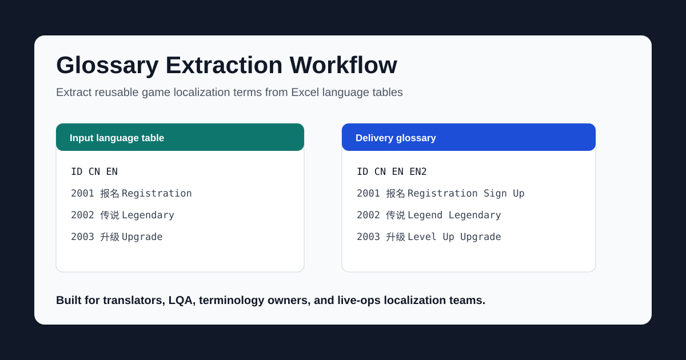
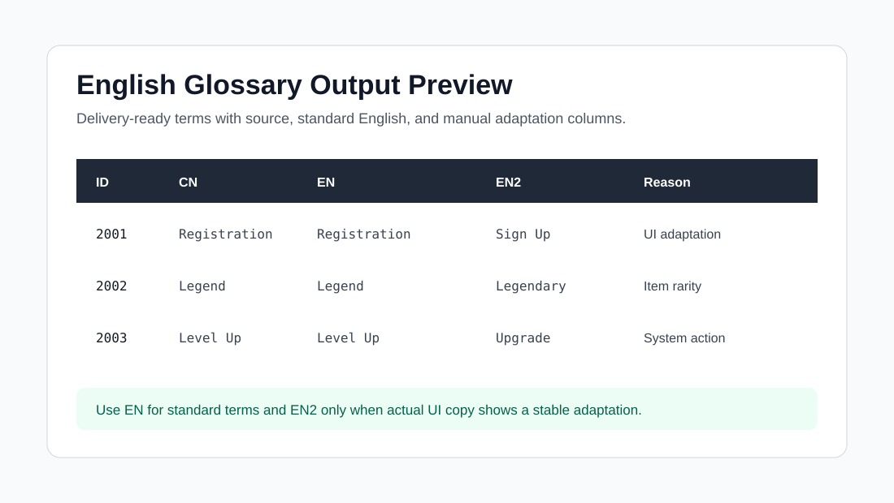

# Glossary Extraction Workflow

> Game localization glossary extraction workflow for Excel language tables, bilingual term review, and delivery-ready `ID / CN / EN / EN2` exports.



这是一个面向**游戏出海本地化团队**的术语提取仓库，用于从完整语言表中提取高频、易混淆、需要统一维护的术语，并生成交付版 `ID / CN / EN / EN2` 术语表。

**Keywords:** glossary extraction, game localization glossary, terminology workflow, Excel language table, translation glossary, EN EN2 mapping, localization term management, game translation operations.

## Current Version

Current repository version: **v0.4.0**. See [CHANGELOG.md](CHANGELOG.md) for release notes.

## Downstream Sync

This repository is the single maintenance source for the glossary extraction workflow. Localization Workflow Studio embeds a read-only sync artifact at `workflow/glossary` (see its `SYNC.md`). After landing changes here, sync the studio copy from the studio repo root:

```powershell
python scripts/sync_workflow_sources.py glossary
```

Never edit the embedded studio copy directly.

Main supported workflows:

- Full language-table glossary extraction: `ID / CN / EN / EN2`.
- Source-only glossary extraction for projects without approved target translations.
- Project brief and translation prompt generation from language tables plus project materials.
- Announcement-specific glossary lookup from `docx / txt / md / json / csv / tsv / xlsx`.
- Multi-language announcement lookup with explicit `LANG=path` inputs.
- Optional AI supplement interface for announcement leak-checking, sentence-level term splitting, confidence notes, and project-name translation warnings.
- Local harness regression for core extraction, observation feedback, announcement lookup, and AI supplement behavior.

## Why This Project Exists

Localization teams often store useful term decisions inside huge language tables, chat threads, or ad hoc spreadsheets. This project turns that mess into a repeatable workflow that:

- extracts high-value terms from full language tables
- separates standard examples from manual adaptations
- preserves reusable review knowledge across versions
- produces delivery-ready glossary files for translators, LQA, and terminology owners

## 中文简介

面向游戏出海本地化团队的可复用仓库，用于从完整语言表中提取高频、易混淆、需要统一维护的术语，并生成交付版 `ID / CN / EN / EN2` 术语表。

## 30-Second Example

```bash
git clone https://github.com/zhangzeyu99-web/glossary-extraction-workflow.git
cd glossary-extraction-workflow
python -m pip install -r requirements.txt
python scripts/run_glossary_harness.py fixtures/core_regression.json
```

## English Sample Input and Output



- [English sample input CSV](examples/english-sample-input.csv)
- [English sample glossary output](examples/english-sample-output.md)

## 仓库目标

- 把术语提取从“临时人工整理”变成“可重复执行的标准流程”
- 用统一规则区分 `示例用法` 和 `手动适配`
- 输出可直接下发给翻译、LQA、术语管理员的交付表
- 给后续版本迭代留下测试、模板、维护清单和回归基线

## 目录结构

```text
.
├─ .github/
│  ├─ ISSUE_TEMPLATE/
│  └─ workflows/
├─ docs/
├─ examples/
├─ scripts/
├─ templates/
├─ tests/
├─ CHANGELOG.md
├─ VERSION
├─ .gitignore
└─ requirements.txt
```

## 快速开始

### 1. 安装依赖

```bash
python -m pip install -r requirements.txt
```

### 2. 准备语言表

最小表头要求见 [templates/language_table_minimum_headers.tsv](templates/language_table_minimum_headers.tsv)。

默认约定：

- `ID`：文本 ID
- `cn`：中文原文
- `en`：英语译文

### 3. 执行提取

```bash
python scripts/extract_glossary.py /path/to/language_table.xlsx
```

如果表头不是默认值，可以显式传参：

```bash
python scripts/extract_glossary.py /path/to/language_table.xlsx \
  --sheet Sheet0 \
  --id-column ID \
  --source-column cn \
  --target-column en
```

如果当前只有中文源文、没有英文译文列，可以使用源文-only 模式：

```bash
python scripts/extract_glossary.py /path/to/source_table.xlsx \
  --source-only \
  --include-empty-final-terms
```

这种模式仍输出 `ID / CN / EN / EN2`，其中 `EN / EN2` 会先留空，或由 `curated_terms.json` 中已有人工规则自动补上。

默认会同时读写两层经验数据：

```bash
python scripts/extract_glossary.py /path/to/language_table.xlsx \
  --curated-rules data/experience/curated_terms.json \
  --observations-store data/experience/observed_terms.json
```

### 4. 项目审查与风格提示词

每次扫描完整语言包时，脚本会同步输出一份项目审查 Markdown：

- `*_project_brief_YYYYMMDD.md`
  输出两块内容：`AI 生成的专属翻译提示词` 和 `项目元信息`。提示词会按项目类型区分 UI/玩法文案与剧情对话，例如 UI 适配移动端并尽量精简，剧情则要求自然、地道、通顺，参考美剧日常对白节奏。

可显式指定项目名和输出路径：

```bash
python scripts/extract_glossary.py /path/to/language_table.xlsx \
  --project-name "Project Name" \
  --project-brief-output /path/to/project_brief.md
```

可以把额外游戏资料一起纳入 brief 判断，例如项目简介、世界观文档、已有翻译文本、术语表、截图文件名，或由人工观察图片后写成备注：

```bash
python scripts/extract_glossary.py /path/to/language_table.xlsx \
  --project-material /path/to/project_notes.md \
  --project-material /path/to/reference_terms.xlsx \
  --project-material /path/to/aircraft_battle_ui.png \
  --project-note "截图显示深色科幻机库、战机强化和导弹战斗界面。"
```

`--project-material` 支持重复传入，当前支持 `txt / md / json / csv / tsv / xlsx`，图片文件会使用文件名和目录名作为题材线索；如果需要利用图片画面内容，建议用 `--project-note` 写入人工观察或 OCR 结果。

如果只想额外导出纯提示词：

```bash
python scripts/extract_glossary.py /path/to/language_table.xlsx \
  --translation-prompt-output /path/to/translation_prompt.txt
```

如果某次只需要术语表，不需要项目审查：

```bash
python scripts/extract_glossary.py /path/to/language_table.xlsx \
  --no-project-brief
```

### 5. 版更公告按需术语提取

当需要翻译版更公告、活动公告或长篇更新说明时，可以用公告文本反查完整语言表中的术语，只导出公告实际用到的术语行，并保留完整语言表中的全部语言列：

```bash
python scripts/extract_glossary.py /path/to/language_table.xlsx \
  --announcement-material /path/to/update_notice.docx \
  --announcement-output /path/to/update_notice_terms.xlsx
```

如果没有同时指定 `--output`、`--final-output`、`--project-brief-output` 或补充项目资料参数，脚本会自动进入公告专用模式，只生成公告术语表，避免为大语言表额外生成完整明细表。

脚本会自动识别常见导出型总表表头，不要求表头在第 1 行；例如 `索引ID / 内容 / 中文，用于导出...` 会映射为 `ID / CN / EN`。对于 `["活动名"]`、`["活动名", "#色值"]`、嵌套帮助列表标题等非规范单元格，也会提取干净术语和对应译文。

公告资料可以重复传入，支持 `docx / txt / md / json / csv / tsv / xlsx`：

```bash
python scripts/extract_glossary.py /path/to/language_table.xlsx \
  --announcement-material /path/to/update_notice.txt \
  --announcement-material /path/to/event_notes.xlsx \
  --announcement-output /path/to/announcement_terms.xlsx \
  --announcement-min-hit 1
```

多语言公告术语合并使用显式语言码，避免依赖文件名猜测：

```bash
python scripts/extract_glossary.py \
  --language-table EN=/path/to/language_en.xlsx \
  --language-table FR=/path/to/language_fr.xlsx \
  --announcement-material /path/to/update_notice.txt \
  --announcement-output /path/to/announcement_terms.xlsx
```

AI 补充层用于提高召回率，但默认不把完整语言包交给模型。脚本仍然先做本地精确 lookup；启用后只导出公告文本、已命中术语和本地摘取的少量相关句内证据。

Codex 线程内执行术语任务时，推荐流程是先生成 packet，由当前 Codex 模型直接做漏词补充、句内术语拆分和置信检查，再把结构化 response 回填给脚本：

```bash
python scripts/extract_glossary.py /path/to/language_table.xlsx \
  --announcement-material /path/to/update_notice.txt \
  --announcement-output /path/to/announcement_terms.xlsx \
  --project-name "Project Name" \
  --ai-supplement \
  --ai-supplement-provider packet \
  --ai-supplement-packet-output /path/to/update_notice_ai_packet.json
```

Codex 读取 packet 后生成 `/path/to/ai_response.json`，再回填。可信且有语言表证据的补充术语会并入主表；置信度、证据和项目名译文缺失提醒只写 sidecar 报告：

```bash
python scripts/extract_glossary.py /path/to/language_table.xlsx \
  --announcement-material /path/to/update_notice.txt \
  --announcement-output /path/to/announcement_terms.xlsx \
  --project-name "Project Name" \
  --ai-supplement \
  --ai-supplement-provider file \
  --ai-supplement-response /path/to/ai_response.json \
  --ai-supplement-report-output /path/to/ai_supplement_report.md
```

如果要脱离 Codex 线程自动跑，也可以设置 `OPENAI_API_KEY` 并使用 `--ai-supplement-provider openai` 或 `auto`。`--ai-supplement-provider` 支持 `auto / openai / file / packet`；`auto` 的优先级是：`--ai-supplement-response` 文件、`OPENAI_API_KEY` 自动调用、packet-only fallback。

Codex 线程内执行规范见 [docs/codex-thread-ai-supplement.md](docs/codex-thread-ai-supplement.md)。该规范要求每次线程内跑术语提取时，脚本结果后必须由 Codex 做一次补充检查。

输出 workbook 只有一个 `Glossary` sheet，列结构沿用完整语言表表头，例如 `ID / CN / EN / FR / DE / RU / IT / ES / PT / ...`。默认不输出缺少英文译文的术语，如需保留空译文候选，可加 `--include-empty-final-terms`。

多语言合并模式输出 `ID / CN / EN / FR...`。`玩家 / 活动 / 查看 / 购买 / 发送 / 获得 / 奖励` 等低价值通用词不会被删除，只会排到系统名、活动名、玩法名、道具名之后。默认只生成术语译文交付表；如需内部审计，可显式传 `--announcement-validation-output /path/to/announcement_validation.md` 生成 validation Markdown。

### 6. 产物说明

脚本默认在输入文件同目录输出两份 Excel：

- `*_glossary_details_YYYYMMDD.xlsx`
  工作明细版，包含候选术语、风险、示例用法、手动适配、差异说明
- `*_ID_CN_EN_EN2_YYYYMMDD.xlsx`
  干净交付版，只保留 `ID / CN / EN / EN2`
- `*_project_brief_YYYYMMDD.md`
  精简项目 brief，用于给译员、LQA 或翻译模型快速建立项目语气和术语使用边界
- `*_announcement_terms_YYYYMMDD.xlsx`
  版更公告按需术语表，只保留公告中实际出现的术语行，并保留完整语言表中的全部语言列

同时会更新：

- `data/experience/curated_terms.json`
  人工确认层，保存 `approved_en / approved_en2 / block_en2 / note`
- `data/experience/observed_terms.json`
  自动观察层，保存历史出现过的候选、手动适配、命中次数和上次输入指纹

### 7. 回灌人工确认结果

当你已经拿到人工确认过的最终交付表，可以直接回灌到人工规则层：

```bash
python scripts/import_curated_glossary.py /path/to/final_glossary.xlsx \
  --curated-rules data/experience/curated_terms.json
```

默认读取 `Glossary` sheet，按 `ID / CN / EN / EN2` 回写规则：

- `EN` 写入 `approved_en`
- `EN2` 非空时写入 `approved_en2`
- `EN2` 为空时自动设置 `block_en2 = true`

## EN 与 EN2 的口径

- `EN`
  标准示例英语。优先使用独立词条或最短可成立示例中的译法。
- `EN2`
  手动适配英语。仅当实际短句里稳定出现另一套用词时才写入；噪音词、不稳定上下文不强行写入。

典型示例：

- `报名` -> `Registration / Sign Up`
- `传说` -> `Legend / Legendary`
- `升级` -> `Level Up / Upgrade`
- `突破` -> `Evolve / Promote`

## 工作流文档

- [CHANGELOG.md](CHANGELOG.md)：版本记录
- [docs/workflow.md](docs/workflow.md)：完整提炼流程
- [docs/maintenance.md](docs/maintenance.md)：维护与回归规范
- [docs/source-only-delivery-retrospective.md](docs/source-only-delivery-retrospective.md)：源文-only 术语提取、预翻译、分类整理和标准命名复盘

## Harness 回归

仓库内置 fixture 驱动的 harness，用来做回归验证：

```bash
python scripts/run_glossary_harness.py fixtures/core_regression.json
```

可选输出 JSON 报告：

```bash
python scripts/run_glossary_harness.py fixtures/core_regression.json \
  --report-output output/harness-report.json
```

harness 会检查：

- 预期术语是否被提取
- `EN / EN2` 是否命中
- 不应进入术语表的词是否被误提
- 当前输出是否和历史基线漂移

## 自动积累经验

经验层现在拆成两部分：

- [data/experience/curated_terms.json](data/experience/curated_terms.json)
- [data/experience/observed_terms.json](data/experience/observed_terms.json)

人工确认层支持三类核心信息：

- `approved_en`
  已确认的标准 EN
- `approved_en2`
  已确认的手动适配 EN2
- `block_en2`
  明确禁止自动派生 EN2 的术语

自动观察层会在每次运行后累积：

- `observed_exact_candidates`
- `observed_example_usages`
- `observed_manual_adaptations`
- `seen_runs`
- `last_seen_at`

提取时会先读人工确认层，再把历史观察合并进候选判断，减少同一术语在不同版本里来回漂移。

## 模板与示例

- [templates/final_glossary_headers.tsv](templates/final_glossary_headers.tsv)
- [templates/language_table_minimum_headers.tsv](templates/language_table_minimum_headers.tsv)
- [templates/delivery_status_naming.tsv](templates/delivery_status_naming.tsv)
- [templates/maintenance_checklist.md](templates/maintenance_checklist.md)
- [examples/README.md](examples/README.md)

## 测试

```bash
python -m pytest
```

额外建议每次大改后再跑一遍 harness：

```bash
python scripts/run_glossary_harness.py \
  fixtures/core_regression.json \
  fixtures/observation_feedback_regression.json \
  fixtures/announcement_lookup_regression.json \
  fixtures/announcement_ai_supplement_regression.json
```

当前仓库默认提供本地测试命令；如后续账号具备 `workflow` 权限，可再补 GitHub Actions。

## 维护建议

- 每个版本新增语言表后跑一遍脚本
- 对 `EN2` 非空的术语做人工复核
- 每月做一次术语回归，检查新活动、新系统、新养成线是否引入新词
- 不把客户原始语言表直接提交到仓库，示例文件只保留脱敏样例
